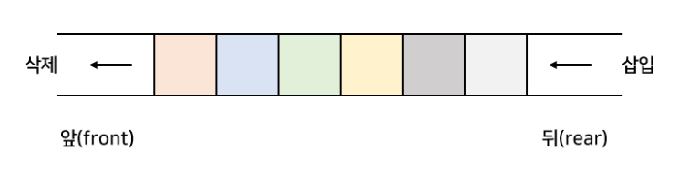
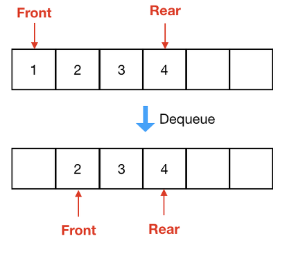
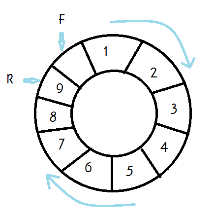
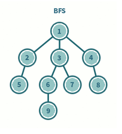

<!-- ## 큐(Queue) -->

### 목차

- [큐(Queue)](#큐queue)
<!-- - [선형 큐](#)
- [원형 큐](#)
- [우선순위 큐](#)
- [큐의 활용: 버퍼](#) -->
- [BFS](#너비-우선-탐색breadth-first-search-bfs)

#### 큐(Queue)
- **큐(Queue)의 특성**
  - 스택과 마찬가지로 삽입과 삭제의 위치가 제한적인 자료구조
    - 큐의 뒤에서는 삽입만, 큐의 앞에서는 삭제만 이루어지는 구조
  - 선입선출 구조(FIFO: First In First Out)
    - 큐에 삽입한 순서대로 원소가 저장되어, 가장 먼저 삽입된 원소는 가장 먼저 삭제   

 


#### 큐의 주요 연산

|연산|기능|
|-------  |---------  |
| enQueue(item) |큐의 뒤쪽(rear 다음)에 원소를 삽입하는 연산  |
| deQueue() | 큐의 앞쪽(front)에서 원소를 삭제하고 반환하는 연산 |
| createQueue() | 공백 상태의 큐를 생성하는 연산 |
|isEmpty()  | 큐가 공백상태인지를 확인하는 연산  |
|isFull()  | 큐가 포화상태인지를 확인하는 연산 |
| Qpeek() | 큐의 앞쪽(front)에서 원소를 삭제 없이 반환하는 연산  |

### 선형 큐
- 1차원 배열을 이용한 큐
  - 큐의 크기 = 배열의 크기
  - front: 저장된 첫 번째 원소의 인덱스
  - rear: 저장된 마지막 원소의 인덱스
- 상태 표현
  - 초기 상태: front = rear = -1
  - 공백 상태: front == rear
  - 포화 상태: rear == n-1 (n: 배열의 크기, n-1: 배열의 마지막 인덱스)

#### 큐의 구현
- 삽입: enQueue(item)
  - 마지막 원소 뒤에 새로운 원소를 삽입
  1. rear값을 하나 증가시켜 새로운 원소를 삽입할 자리를 마련
  2. 그 인덱스에 해당하는 배열 원소 Q[rear]에 item을 저장

```py
# 선형 큐에서 front와 rear의 초기값은 -1
front, rear = -1, -1

# 삽입
def enQueue(item):
    global rear
    if isFull():
        print('Queue_Full')
    else:
        rear += 1
        Q[rear] = item
```
- 삭제: deQueue()
  - 가장 앞에 있는 원소를 삭제
  1. front 값을 하나 증가시켜 큐에 남아있게 될 첫 번째 원소 이동
  2. 새로운 첫 번째 원소를 리턴 함으로써 삭제와 동일한 기능
```py
# 삭제
def deQueue():
    global front
    if isEmpty():
        print('Queue_Empty')
    else:
        front += 1
        return Q[front]
```
- 공백상태 및 포화상태 검사: isEmpty(), isFull()
  - 공백상태: front == rear
  - 포화상태: rear == n-1 (n: 배열의 크기, n-1: 배열의 마지막 인덱스)
```py
# 공백상태 검사
def isEmpty():
    return front == rear

# 포화상태 검사
def isFull():
    return rear == len(Q) - 1
```
- 검색: Qpeek()
  - 가장 앞에 있는 원소를 검색하여 반환하는 연산
  - 현재 front의 한자리 뒤(front+1)에 있는 원소, 즉 큐의 첫 번째에 있는 원소 반환
```py
# 검색
def Qpeek():
    if isEmpty():
        print('Queue_Empty')
    else:
        return Q[front+1]
```
#### 선형 큐 이용시 문제점

- 잘못된 포화 상태 인식
  - 선형 큐를 이용하여 원소의 삽입, 삭제를 계속할 경우, 배열의 앞부분에 활용할 수 있는 공간이 존재함에도 rear=n-1인 상태, 즉 포화상태로 인식하는 경우 삽입을 수행하지 않음
  
- 해결방법1
  - 매 연산이 이루어질 때마다 저장된 원소들을 배열의 앞부분으로 모두 이동
  - 원소 이동에 많은 시간이 소요되어 **큐의 효율성이 떨어짐**
- 해결방법2
  - 1차원배열의 시작과 끝을 연결하여 원형의 큐를 이룬다고 가정하고 사용
  - 원형 큐의 구조   
  


### 너비 우선 탐색(Breadth First Search, BFS)

- 너비우선 탐색은 탐색 시작점의 인접한 정점들을 모두 차례로 방문한 후에, 방문했던 정점을 시작점으로 하여 다시 인접한 정점들을 차례로 방문하는 방식
- 인접한 정점들에 대해 탐색을 한 후, 차례로 다시 너비우선탐색을 진행하므로, 선입선출 형태의 자료구조인 큐를 활용   
 
 
#### BFS 동작 순서
```
1. 루트 노드를 큐에 넣고 방문 처리
2. 큐를 Deque하고, Deque한 노드의 방문하지 않은 모든 인접 노드를 큐에 넣고 방문처리
3. 2단계를 더 이상 수행할 수 없을 때까지(큐가 빌 때 까지)반복
```   

#### BFS 알고리즘
```
def BFS(arr, start) :                # 그래프 arr, 탐색시작점 start
    visited = [0] * (n + 1)          # n : 정점의 개수
    queue = []                       # 큐 생성
    queue.append(start)              # 시작점 v를 큐에 삽입
    while queue:                     # 큐가 비어있지 않은 경우
        t = queue.pop(0)             # 큐의 첫번째 원소 반환
        if not visited[t]:           # 방문되지 않은 곳이라면
            visited[t] = True        # 방문한 것으로 표시
            visit(t)                 # 정점 t에서 할 일
            for i in arr[t]:         # t와 연결된 모든 정점에 대해
                if not visited[i]:   # 방문되지 않은 곳이라면
                    queue.append(i)  # 큐에 넣기

```
#### BFS 예제코드
```py
arr = [
    [0, 0, 0, 0, 1, 0],
    [1, 0, 1, 0, 0, 1],
    [1, 0, 0, 1, 0, 0],
    [1, 1, 0, 0, 0, 0],
    [0, 1, 0, 1, 0, 1],
    [0, 0, 1, 1, 0, 0]
       ]
N = int(input())  # 시작 노드

def BFS(N, n, arr):
    visited = [0] * n  # 방문여부 행렬
    queue = []
    queue.append(N)    # 시작노드 큐에 추가
    visited[N] = 1     # 시작노드 방문 표시
    while queue:  # 큐추가/팝 반복하며 모든 요소 탐색할 때까지(큐가 빌 때까지)
        t = queue.pop(0)  # 첫 인덱스 요소 pop(큐 특성/선입선출)
        print(t)
        for i in range(6):
            if arr[t][i] == 1 and visited[i] == 0:  # 간선이 있고 방문한적이 없는 노드라면
                queue.append(i)  # 큐에 추가
                visited[i] = 1
BFS(N, 6, arr)
```
