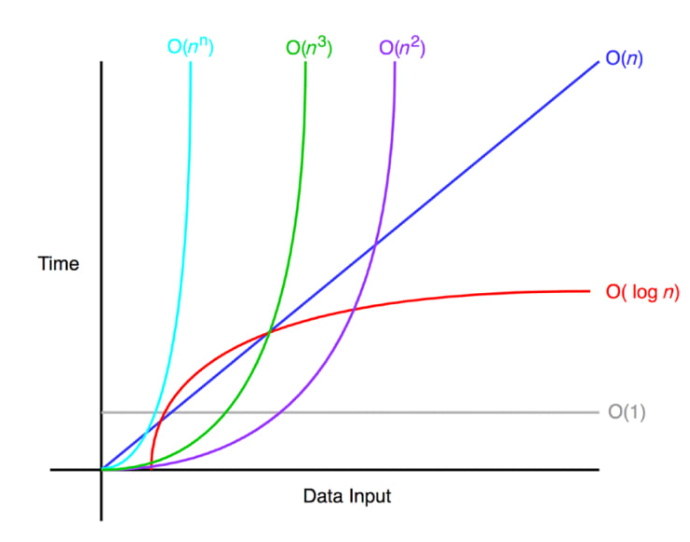
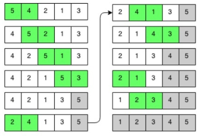

###### swea course 이용
### 목차
- [알고리즘](#알고리즘)
- [배열](#배열)
- [버블 정렬(Bubble Sort)](#버블-정렬)
- [카운팅 정렬(Counting Sort)](#카운팅-정렬)
- [완전검색](#완전검색)
- [그리디(Greedy Algorithm)](#그리디)

### 알고리즘
- 알고리즘: 유한한 단계를 통해 문제를 해결하기 위한 절타나 방법, 주로 컴퓨터 용어로 쓰이며 컴퓨터가 어떤일을 수행하기 위한 단계적 방법
- 어떠한 문제를 해결하기 위한 절차

#### 알고리즘을 표현하는 방법
1. 의사코드
```
CalcSum(n)
    sum <- 0
    for i: 1 -> n
        sum <- sum + i
    return sum;
```
2. 순서도
- 

#### 무엇이 좋은 알고리즘인가
1. 정확성
2. 작업량
3. 메모리 사용량
4. 단순성
5. 최적성

#### 시간복잡도
- 특정한 크기의 입력에 대해 알고리즘이 얼마나 오래 걸리는지 의미
- 알고리즘을 위해 필요한 **연산의 횟수**
- 빅-오 표기법
- 시간 복잡도 함수 중에서 가장 큰 영향력을 주는 n의 항만을 표시
- 계수는 생략
- Big_O 시간 속도 비교
- 

### 배열
- 배열: 일정한 자료형의 변수들을 하나의 이름으로 열거하여 사용하는 자료구조
- 6개의 변수를 사용할 때 배열로 바꾸어 사용

```
Num0 = 0;  Num3 = 3;
Num1 = 1;  Num4 = 4;        =>         Num = [0, 1, 2, 3, 4, 5]
Num2 = 2;  Num5 = 5;
```
#### 배열의 필요성
- 프로그램 내에서 여러 개의 변수가 필요할 때, 일일이 다른 변수명을 이용하여 자료에 접근하는 것은 매우 비효율적이다.
- 배열을 사용하면 하나의 선언을 통해 둘 이상의 변수를 선언할 수 있다.
- 단순히 다수의 변수 선언을 의미하는 것이 아니라, 다수의 변수로는 하기 힘든 작업을 배열을 활용해 쉽게 가능하다.

#### 1차원 배열 선언
- 별도의 선언 방법이 없으면 변수에 처음 값을 할당할 때 생성
  ```py
  Arr = list()      Arr = []
  Arr = [1, 2, 3]   Arr = [0] * 10    1차원 배열 선언의 예
  
  접근
  Arr[0] = 10
  Arr[idx] = 20   인덱스에 값을 저장
  ```
### 정렬
- 2개 이상의 자료를 특정 기준에 의해 작은 값부터 큰 값(오름차순: ascending), 혹은 그 반대의 순서대로(내림차순: descending) 재배열 하는 것
- 키
  - 자료를 정렬하는 기준이 되는 특정 값
  
#### 대표적인 정렬 방식의 종류
- [버블 정렬(Bubble Sort)](#버블-정렬)
- [카운팅 정렬(Counting Sort)](#카운팅-정렬)
- 선택 정렬(Selection Sort)
- 퀵 정렬(Quick Sort)
- 삽입 정렬(Insertion Sort)
- 병합 정렬(Merge Sort)

### 버블 정렬
- 인접한 두개의 원소를 비교하며 자리를 계속 교환하는 방식
- 정렬 과정
  - 첫 번쨰 원소부터 인접한 원소끼리 계속 자리를 교환, 맨 마지막 자리까지 이동
  - 한 단계가 끝나면 가자 큰 원소가 마지막 자리로(오름차순)
- 시간복잡도
  - O(n^2)
#### 버블 정렬 과정
- 
#### 버블 정렬 알고리즘
```c
BubbleSort(a, N)                  # 정렬할 배열과 배열의 크기
    for i : N-1 -> 1              # 정렬될 구간의 끝
        for j : 0 -> i-1          # 비교할 원소 중 왼쪽 원소의 인덱스
            if a[j] > a[j+1]      # 왼쪽 원소가 더 크면
                a[j] <-> a[j+1]   # 오른쪽 원소와 교환
```
```py
def BubbleSort(a, N):            # 정렬할 List, N 원소 수
    for i in range(N-1, 0, -1):  # 범위의 끝 위치
        for j in range(0, i):
            if a[j] > a[j+1]:
                a[j], a[j+1] = a[j+1], a[j]
```
###     카운팅 정렬
- 항목들의 순서를 결정하기 위해 집합에 각 항목이 몇 개씩 있는지 세는 작업, 선형 시간에 정렬하는 효율적인 알고리즘
- 제한사항
  - 정수나 정수로 표현할 수 있는 자료에 대해서만 적용 가능: 각 항목의 발생 회수를 기록하기 위해, 정수 항목으로 인덱스 되는 카운트들의 배열을 사용하기 때문
  - 카운트들을 위한 충분한 공간을 할당하려면 집합 내의 가장 큰 정수를 알아야함
- 시간 복잡도
  - O(n+k) : n은 리스트 길이, k는 정수의 최대값

#### 카운팅 정렬 과정
  


### Reference
[정렬 알고리즘- 나무위키](https://namu.wiki/w/%EC%A0%95%EB%A0%AC%20%EC%95%8C%EA%B3%A0%EB%A6%AC%EC%A6%98#fn-13)