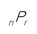
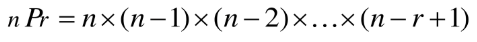
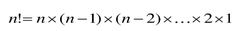
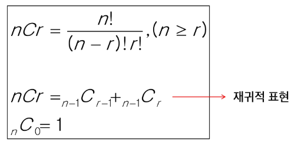

## 응용2. 완전검색 & 그리디

### 목차
- [반복과 재귀](#반복iteration과-재귀recursion)
- [완전검색기법]
- [순열]
- [부분집합]
- [조합]
- [탐욕 알고리즘]
- [활동 선택문제]
- [Baby-jin]

##### 8월 30일
### 반복(Iteration)과 재귀(Recursion)
- 반복과 재귀는 유사한 작업을 수행 가능
- 반복은 수행하는 작업이 완료될 때까지 계속 반복
  - 루프(for, while 구조)
- 재귀는 주어진 문제의 해를 구하기 위해 동일하면서 더 작은 문제의 해를 이용하는 방법
  - 하나의 큰 문제를 해결할 수 있는(해결하기 쉬운) 더 작은 문제로 쪼개고 결과들을 결합
  - 재귀 함수로 구현

#### 반복구조
1. 초기화
   - 반복되는 명령문을 실행하기 전에(한번만) 조건 검사에 사용할 변수의 초기값 설정
2. 조건검사(check control expression)
3. 반복할 명령문 실행(action)
4. 업데이트(loop update)
   - 무한 루프가 되지 않게 조건이 거짓(false)이 되도록 한다.

#### 반복을 이용한 선택정렬
- 예시
 ```py
 def SelectionSort(A):
    n = len(A)
    for i in range(0, n-1):
        minI = i
        for j in range(i+1, n):
            if A[j] < A[minI]:
                minI = j
        A[minI], A[i] = A[i], A[minI]
 ```

### 재귀적 알고리즘
- 재귀적 정의는 두 부분으로 나뉜다.
- 하나 또는 그 이상의 기본경우
  - 집합에 포함되어 있는 원소로 induction을 생성하기 위한 시드(seed)역할
- 하나 또는 그 이상의 유도된 경우
  - 새로운 집합의 원소를 생성하기 위해 결합되어지는 방법

### 재귀 함수(recursive function)
- 함수 내부에서 직접 혹은 간접적으로 자기 자신을 호출하는 함수
- 일반적으로 재귀적 정의를 이용해서 재귀 함수를 구현
- 따라서, 기본 부분(Basis part)와 유도 부분(inductive part)로 구성됨
- 재귀적 프로그램을 작성하는 것은 반복 구조에 비해 간결하고 이해하기 쉽다
- 함수 호출은 프로그램 메모리 구조에서 스택을 사용한다. 따라서 재귀호출은 반복적인 스택의 사용을 의미하며 메모리 및 속도에서 성능저하가 발생

#### 반복과 재귀 선택 방법
- 재귀는 문제 해결을 위한 알고리즘 설계가 간단하고 자연스럽다.
  - 추상 자료형(list, tree 등)의 알고리즘은 재귀적 구현이 간단하고 자연스러운 경우가 많다.
- 일반적으로 재귀적 알고리즘은 반복(Iterative) 알고리즘 보다 더 많은 메모리와 연산을 필요

- <span style = 'color:salmon'> 입력 값 n이 커질수록 재귀 알고리즘은 반복에 비해 비효율적

#### 반복과 재귀의 비교
| |재귀 | 반복|
|---- |---- |---- |
|종료  |재귀 함수 호출이 종료되는 베이스케이스 | 반복문의 종료 조건 |
|수행시간 |(상대적)느림 |빠름 |
|메모리 공간 |(상대적)많이 사용 |적게 사용 |
| 소스 코드 길이|짧고 간결 |길다 |
|소스 코드 형태 |선택구조(if else) | 반복구조(for while)|
|무한 반복시 |스택 오버플로우 |CPU반복해서 점유 |

### 완전탐색(Brute Force)
- brute-force는 문제를 해결하기 위한 간단하고 쉬운 접근법이다.
  - Just do it
  - force의 의미는 사람보다는 컴퓨터의 force를 의미한다.
- 완전탐색 방법은 대부분의 문제에 적용 가능
- 상대적으로 빠른 시간에 알고리즘 설계를 할 수 있다.
- 문제에 포함된 자료(요소, 인스턴스)의 크기가 작다면 유용하다
- 모든 경우의 수를 생성하고 테스트하기 때문에 수행속도는 느리지만 해답을 찾아내지 못할 확률이 낮다.
  - 완전검색은 입력의 크기를 작게 해서 간편하고 빠르게 답을 구하는 프로그램을 작성
- 이를 기반으로 그리디 기법이나 DP(동적 계획법)을 이용해서 효율적인 알고리즘을 찾을 수 있다.
- <span style = 'color:salmon'>우선 완전 검색으로 접근하여 해답을 도출한 후, 성능 개선을 위해 다른 알고리즘을 사용하고 해답을 확인하는 것이 바람직

### 순열(Permutation)
- 서로 다른 것들 중 몇개를 뽑아서 한 줄로 나열하는 것
- 서로 다른 n개 중 r개를 택하는 순열은 아래와 같이 표현
- 
- 그리고 nPr은 다음과 같은 식이 성립
- 
- nPn은 n!이라고 표기하며 Factorial이라 부름
- 
  
### 수열 생성
1. 단순하게 생성하는 법
  - {1, 2, 3}을 포함하는 모든 순열을 생성하는 함수
  ```py
  # 주어진 집합
  elements = [1, 2, 3]
  # 순열 생성 및 출력
  for i1 in elements:
      for i2 in elements:
          if i2 != i1:
              for i3 in elements:
                  if i3 != i1 and i3 != i2:
                      print(i1, i2, i3)
  ```
2. 재귀 호출을 통한 순열 생성
  ```py
  def perm(i, N, K): # i는 이전에 고른 개수, N개에서 K개를 고르는 순열
    global cnt
    if i == K: # 순열 완성 : K를 모두 고른 경우
        cnt += 1
        print(cnt, p)
        return
    else:
        for j in range(N): # p[i]에 들어갈 숫자를 결정
            if used[j] == 0: # 아직 사용되기 전이라면
                p[i] = card[j]
                used[j] = 1
                perm(i + 1, N, K)
                used[j] = 0

  card = [1, 2, 3, 4, 5]
  N = 5 # N개의 카드에서
  K = 3 # K개를 뽑아 만드는 순열
  used = [0] * N #사용한 카드인지 표시하는 리스트
  p = [0] * K
  cnt = 0
  perm(0, N, K)
  ```

### 부분 집합(Power set)
- 집합에 포함된 원소들을 선택하는 것
- 다수의 중요 알고리즘들이 원소들의 그룹에서 최적의 부분 집합을 찾는 것
  - ex) 배낭 짐싸기
- N 개의 원소를 포함한 집합
  - 자기 자신과 공집합 포함한 모든 부분집합(power set)의 개수는 2^n개
  - 원소의 수가 증가하면 부분집합의 개수는 지수적으로 증가
#### 부분 집합 생성
1. 단순하게 모든 부분 집합 생성
  - 4개 원소를 포함한 집합에 대한 부분 집합 구하기
  ```py
  for i1 in range(2):
      bit = [0, 0, 0, 0]  # 비트 배열 초기화
      bit[0] = i1
      for i2 in range(2):
          bit[1] = i2
          for i3 in range(2):
              bit[2] = i3
              for i4 in range(2):
                  bit[3] = i4
                  print(bit)
  ```
2. 바이너리 카운팅을 통한 부분집합 생성
  ```py
  a = [1, 2, 3, 4]
  N = 4
  ## 나누었을때 중복된 집합들을 없애기 위해
  # (1<<N)//2 == 1<<(N-1)까지만
  for i in range(1, (1<<N)//2): # 2의 N승번 반복(1이 왼쪽으로 N번만큼 이동)
      subset1 = []
      subset2 = []
      for j in range(N):
      
          if i & (1<<j): #j번 비트가 0이 아니면
              subset1.append(a[j])
          else:
              subset2.append(a[j])
      
      print(subset1, subset2)
  ```
##### 8월 31일
### 조합(combination)
- 서로 다른 n개의 원소 중 r개를 순서없이 골라낸 것
- 조합의 수식   
  

#### 조합을 만드는 방법
- 재귀 호출을 이용해 만들기
  ```py
  def ncr(n, r):
      if r == 0:
          print(tr)
      elif n < r: #남은 원소보다 많은 원소를 선택해야 하는 경우
          return #불가
      else:
          tr[r-1] = a[n-1] # a[n-1] 조합에 포함시키는 경우
          ncr(n-1, r-1)
          ncr(n-1, r)  # a[n-1]을 포함시키지 않는 경우

  N = 5
  R = 3
  a = [1, 2, 3, 4, 5]
  tr = [0] * R
  ncr(N, R)
  ```