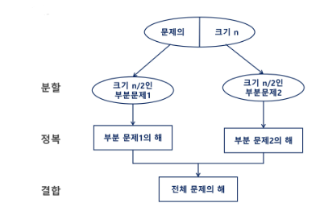
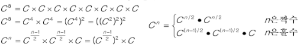
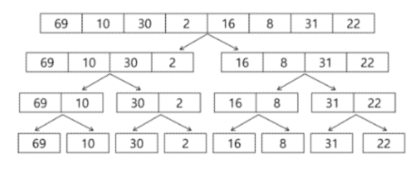
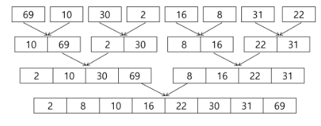

### 알고리즘 설계 기법의 종류
1. 전체를 다 보자 (Brute Force - 완전 탐색)
    - 배열: 반복문을 다 돌리기
    - 그래프: DFS, BFS
2. 상황마다 좋은 걸 고르자 (Greedy - 탐욕)
    - 규칙을 찾는 것
    - 주의사항: 항상 좋은 것을 뽑아도, 최종 결과가 제일 좋지는 않다.
3. 하나의 큰 문제를 작은 문제로 나누어 부분적으로 해결하자(Dynamic Programming)
    - Memorization 기법을 활용
    - 점화식(bottom-up), 재귀(top-down)
4. 큰 문제를 작은 문제로 쪼개서 해결하자
   - Divide and Conquer - 분할 정복
5. 전체 중, 가능성 없는 것을 빼고 보자
    - 백트래킹(Back-tracking)
    - 가지치기
### 분할 정복
- 유래
  - 1805년 12월 2일  아우스터리츠 전투에서 나폴레옹이 사용한 전략
  - 전력이 우세한 연합군을 공격하기 위해 나폴레옹은 연합군의 중앙부로 쳐들어가 연합군을 둘로 나눔
  - 둘로 나뉜 연합군을 한 부분씩 격파함
- 설계 전략
  - 분할(Divide): 해결할 문제를 여러개의 작은 부분으로 나눔
  - 정복(Conquer): 나눈 작은 문제를 각각 해결
  - 통합(Combine): (필요하다면) 해결된 해답을 종합

#### 분할 정복 기법
- Top-down approach   
 

#### 분할 정복 기반의 알고리즘(거듭 제곱)
- 시간 복잡도: O(log2 n)
- 
  ```py
  # x^n 구하기
  def Recursive_Power(x, n):
    if n == 1:
        return x
    if n % 2 == 0:
        y = Recursive_Power(x, n/2)
        return y * y
    else:
        y = Recursive_Power(x, (n-1)/2)
        return y * y * x

    
  ```

### 병합 정렬(Merge Sort)
- 병합 정렬 과정
  - {69, 10, 30, 2, 16, 8, 31, 22}를 병합 정렬하는 과정
  - 분할 단계: 전체 자료 집합에 대하여, 최소 크기의 부분집합이 될 때까지 분할 작업을 진행
  - 
  - 병합 단계: 2개의 부분집합을 정렬하면서 하나의 집합으로 병합
  - 8개의 부분집합이 1개로 병합될 때까지 반복
  - 

  ```py
    def merge_sort(arr):
        # 재귀호출 탈출조건
        if len(arr) < 2:
            return arr
        # 분할과정(재귀)
        mid = len(arr) // 2
        low_arr = merge_sort(arr[:mid])
        high_arr = merge_sort(arr[mid:])
        # 병합과정
        merged_arr = []
        l = h = 0
        while l < len(low_arr) and h < len(high_arr):
            if low_arr[l] < high_arr[h]:
                merged_arr.append(low_arr[l])
                l += 1
            else:
                merged_arr.append(high_arr[h])
                h += 1
        merged_arr += low_arr[l:]
        merged_arr += high_arr[h:]
        return merged_arr

    arr = [6, 5, 3, 1, 8, 7, 2, 4]
    print(merge_sort(arr))
  ```
  

### 퀵 정렬


### 이진 검색(Binary search)
- 자료의 가운데에 있는 항목의 키 값과 비교하여 다음 검색의 위치를 결정하고 검색을 계속 진행하는 방법
  - 목적 키를 찾을 때까지 이진 검색을 순환적으로 반복 수행함으로써 검색 범위를 반으로 줄여가면서 보다 빠르게 검색을 수행
- 이진 검색을 하기 위해서는 자료가 **정렬**된 상태가 필수
- 검색 과정
    1. 자료의 중앙에 있는 원소를 선택
    2. 중앙 원소의 값과 찾고자 하는 목표 값을 비교
    3. 목표 값이 중앙 원소의 값보다 작으면 자료의 왼쪽에 대해서 새로 검색 수행, 크다면 자료의 오른쪽에 대해서 새로 검색 수행
    4. 찾고자 하는 값을 찾을 때까지 1~3과정 반복
#### 이진 검색 코드1
```py
def binary_search(arr, target):
    low, high = 0, len(arr) - 1

    # low > high 라면 데이터를 못찾은 경우
    while low <= high:
        # 중간 인덱스 계산
        mid = (low + high) // 2  
        
        # 1. 타겟을 찾았을 경우 해당 인덱스 반환
        if arr[mid] == target:
            return mid  
        # 2. 가운데 값이 정답보다 작은 경우
        elif arr[mid] < target:
            low = mid + 1  # 
        # 3. 가운데 값이 정답보다 큰 경우
        else:
            high = mid - 1

    return -1  # 타겟이 배열에 없을 경우 -1을 반환

# 사용 예제:
my_list = [1, 3, 5, 7, 9, 11, 13]
my_list.sort() # 정렬되어 있지 않을 수도 있기 때문에
target = 7
result = binary_search(my_list, target)

if result != -1:
    print(f"타겟 {target}은 인덱스 {result}에 있습니다.")
else:
    print(f"타겟 {target}은 리스트에 없습니다.")
```

#### 이진 검색 코드2(재귀 활용)
```py
def binary_search_recursive(arr, target, low, high):
    # 기저 조건: 언제까지 재귀호출을 반복할 것인지
    # low > high 라면 데이터 못찾음
    if low > high:
        return -1  
    # 중간 인덱스 계산
    mid = (low + high) // 2 

    # 1. 타겟을 찾았을 경우 해당 인덱스 반환
    if arr[mid] == target:
        return mid  
    # 2. 가운데 값이 정답보다 작은 경우
    elif arr[mid] < target:
        return binary_search_recursive(arr, target, mid + 1, high)  
    # 3. 가운데 값이 정답보다 큰 경우
    else:
        return binary_search_recursive(arr, target, low, mid - 1)  
# 사용 예제:
my_list = [1, 3, 5, 7, 9, 11, 13]
my_list.sort() # 정렬되어 있지 않을 수도 있기 때문에
target = 7
result = binary_search_recursive(my_list, target, 0, len(my_list) - 1)

if result != -1:
    print(f"타겟 {target}은 인덱스 {result}에 있습니다.")
else:
    print(f"타겟 {target}은 리스트에 없습니다.")

```