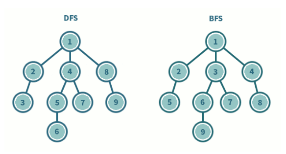

#### 그래프 구조 탐색 방법
- 비선형 구조인 그래프 구조는 그래프로 표현된 모든 자료를 빠짐없이 검색하는 것이 중요
- 두 가지 방법
  - 깊이 우선 탐색 (Depth First Search, DFS) <- Stack
  - 너비 우선 탐색 (Breadth First Search, BFS) <- Queue   
 

#### DFS(깊이 우선 탐색)
- 시작 방향으로 갈 수 있는 경로로 끝까지 깊이 탐색 후 다른 갈림길도 동일한 방식으로 탐색을 반복하여 모든 정점을 방문하는 순회방법
- 가장 마지막에 만났던 갈림길의 정점으로 되돌아가서 다시 깊이 우선 탐색을 반복해야 하므로 **후입선출 구조**의 스택사용

#### DFS 알고리즘
1. 시작 정점 v를 결정하여 방문
2. 정점 v에 인접한 정점 중에서
    1. 방문하지 않은 정점 w가 있으면, 정점 v를 스택에 push하고 정점 w방문
    2. 방문하지 않은 정점이 없으면, 탐색의 방향을 바꾸기 위해 스택을 pop하여 받은 가장 마지막 방문 정점을 v로 하여 다시 2. 반복
3. 스택이 공백이 될 때까지 2. 반복한다

```c
visited[], stack[] 초기화
DFS(v)
    시작점 v 방문;
    visited[v] <- true;
    while{
        if (v의 인접 정점 중 방문 안 한 정점 w가 있으면)
            push(v);
            v <- w; (w에 방문)
            visited[w] <- true;
        else
            if (스택이 비어 있지 않으면)
                v <- pop(stack);
            else 
                break
    }
end DFS()    
```
#### 깊이 우선 탐색 과정
```
1. 그래프의 시작 노드에서 출발, 먼저 시작 노드 v를 방문하고 방문하였다고 표시
2. v에 인접한 노드들 중에서 아직 방문하지 않은 노드 u를 선택
3. 만약 그러한 노드가 없다면 탐색 종료
4. 만약 아직 방문하지 않은 노드 u가 있다면 u를 시작 노드로 하여 깊이 우선 탐색을 다시 시작
5. 이 탐색이 끝나게 되면 다시 v에 인접한 노드들 중에서 아직 방문이 안 된 노드를 찾음
6. 없을 경우 종료, 있다면 다시 그 노드를 시작 노드로 하여 깊이 우선 탐색 반복
```


