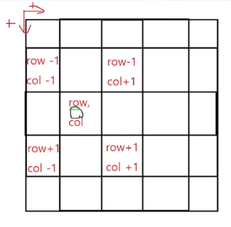

## DAT
- Direct Access Table
- 인덱스를 이용하여 바로 데이터를 찾을 수 있는 테이블

### DAT가 쓰이는 경우
- 어떤 문자(숫자, 문자 둘 다 가능)가 존재하는지
- 어떤 문자의 개수는 몇개인지
- 어떤 문자가 어느 위치에 존재하는지
  ```
  - DAT[1], DAT[str[i]]=DAT['A']
  - DAT[str[i-1]][str[i]]
  ```
- [dat예제](/DAT.cpp)

## 방향배열
- 행은 아래로 갈 수록 +1
- 열은 우측으로 갈수록 +1
- 
- 방향에 해당하는 보정값을 배열에 저장
  - 원하는 방향마다 하나하나 보정해 주는 것이 아님
- BFS, DFS에 응용
- [방향배열 예제](/방향배열.cpp)