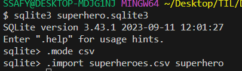

# DB 기초

## DB(Database)란 ?

- 조직화된 데이터의 모음
  - 우리가 프로그램에서 사용할 데이터를 구조화해서 저장만 해놓은 것
  - 예시) 서울 4반 학생 -> 학생1(이름, 성별, 나이 ...) , 학생2(이름, 성별, 나이 ...) 
  - 저장, 조회, 삭제, 수정 등의 추가작업은 어떻게하는가 ?
- 일반적으로 DBMS(Database Management System) 을 DB라 부름
  - 즉, 관리 시스템을 DB 라고 칭한다.

## DB 의 구성요소
- 목표 : 일상 생활의 객체를 DB에 표현하고 저장

- 개체(Entity), 스키마(Schema), 테이블(Table)
  - 개체(Entity)
    - 저장하고자 하는 실제 객체나 개념을 정리한 것
    - 각 엔티티는 여러 속성(Attributes)으로 구성된다
    - 예시) 서울 4반 학생들의 성별, 나이에 따른 롤 티어를 분석하고 싶다.
      - 내가 무엇을 저장해야할까 ?
        - 서울 4반 학생: 이름, 성별, 나이, 롤 티어 등등
    - 관계도 : ERD(Entity Relationship Diagram)
  - 스키마(Schema)
    - 엔티티와 속성들의 구조, 관계, 제약 조건 등을 정의 한 것
    - 엔티티들을 어떻게 구조화할 지(저장할 지) 논리적으로 설계한 것
    - 예시) 서울 4반 학생
      - 이름: 문자열로 저장
      - 나이: 숫자로 저장
      - 롤티어: 문자열로 저장
  - 테이블(Table)
    - 실제로 DB에 저장되는 객체
    - 구성 요소
      - 행(Row), 레코드(Record), 튜플(Tuple)
        - 가로 줄
        - 하나의 데이터 항목
      - 열(Column), 속성(Attribute), 필드(Field)
        - 세로 줄
        - 어떤 데이터를 저장할 것인지 나타냄
- 속성(Attribute)
  - 엔티티가 가지는 항목으로, 저장하고 싶은 개체의 특정 항목을 의미함
- 관계(Relationship)
  - 두 가지 이상의 엔티티 사이의 관계
  - 예시) 추가적으로 서울 4반의 강사 정보를 관리하고 싶다.
    - 강사 정보를 따로 저장해야 한다.
      - 다 같이 저장하면, 중복이 매우 많이 발생한다!
    - "서울 4반 학생" - "강사"는 연관된 데이터. 관계가 있다라고 말한다.

## DB 의 종류

1. 관계형 데이터베이스(RDBMS)
 - 데이터를 테이블, 행, 열 등으로 나누어 구조화 하는 방식
 - 테이블 간 관계를 설정하여 여러 데이터를 조작, 관리 할 수 있음
 - 데이터의 무결성(정확성, 일관성) 유지에 장점이 있음
   - 정확성: 데이터가 정확한 값을 갖는 것(제약 조건에 위반은 없는가, 누락이 없는가, 중복은 없는다 등등)
   - 일관성: DB 내의 모든 데이터가 일관된 상태를 유지하는 것
     - 예시) 한 테이블에서 삭제된 데이터가 다른 테이블에서 참조된다면, 자동으로 함께 삭제
 - 단점
   - 테이블이 나뉘어져 있다.
     - 쿼리문이 복잡하다.
     - 대용량 데이터 처리가 어렵다.
   - 데이터의 규모가 커지면 성능 개선을 해야한다.
     - 수평적 확장이 불가능하다.
     - 수직적 확장
       - 더 좋은 컴퓨터를 쓴다.
     - 수평적 확장
       - 여러 PC 에서 분산하여 처리하도록 한다.
       - 하나의 DBMS를 여러 서버에 분산하여 저장 및 처리
       - 이를 분산 데이터베이스(Distributed Database)

2. 비관계형 데이터베이스(NoSQL)
   - 관계형 데이터베이스의 한계를 극복하기 위해 사용
     - 확장성: 수직, 수평적 확장이 모두 가능함
     - 유연성: 스키마가 고정된 RDB 와 달리 스키마가 유동적이어서 데이터의 구조를 유연하게 변경할 수 있음
     - 다양한 데이터 모델: 다양한 형태의 데이터를 효율적으로 처리 가능
       - 데이터 모델: 데이터의 구조와 관계, 속성 등을 정의하는 방법. 즉, 데이터를 어떻게 저장할 것인가?
     - 높은 가용성: 분산 데이터베이스 구조를 사용할 경우, 하나의 서버가 죽더라도 데이터 유실 없이 서비스 가능
   - 데이터 모델에 따른 종류
     1. key-value Database
        - 데이터가 Key, Value 의 쌍으로 저장됨
        - Key 가 고유하게 레코드를 식별하며, 데이터ㅔ이스 내에서 저장과 검색을 하는 데 사용됨
        - 대표적인 DB: Redis
          - 캐시 DB로 많이 사용함(하드 디스크가 아닌 RAM 에 데이터를 저장함)
          - 자주 사용되는 데이터를 굉장히 빠르게 조회 가능
     2. Document Database
        - 다양한 형태의 비정형 데이터를 저장하고 처리할 수 있는 DB
        - 데이터를 문서(document) 형태로 저장함. 대게는 JSON, XML 등의 형태이며, key-value 형식으로 구성되어 있음
        - 사전 정의된 스키마가 필요 없다. -> 데이터의 유연성을 높이고, 개발 및 유지보수가 편하다
        - 대표적인 DB: MongoDB, Amazon DocumentDB
        - 대부분 분산을 염두하여 만들어짐
        - 따라서, 데이터 입출력이 잦은 서비스에 사용(SNS, 실시간채팅, 게시판 등)
     3. Graph, Column-family 등등 다양한 DB가 존재한다.

## SQL 

- SQL 명령어는 크게 세 가지 그룹으로 분류

1. DDL(Data Definitaion Language) - 데이터 정의 언어
   - 데이터베이스 구조(테이블, 스키마)를 다루기 위한 명령어
   - 실제로 유지보수 단계에서 많은 회의를 거쳐서 하는 작업
     - 테이블 간의 관계가 있기 때문에, 변경이 굉장히 어렵다!
     - 잘못 설계하면 시스템의 성능에 치명적일 수 있다.
   - 신입은 잘 안건드는 명령어, 명세서를 받고 그대로 작업하면 됨.

2. DML(Data Manipulation Language) - 데이터 조작 언어
   - 데이터를 조작(CRUD) 하기 위한 명령어
   - 우리가 가장 잘 알아야 될 명령어
   - 나쁜 SQL 은 시스템의 성능을 나쁘게 만든다!

3. DCL(Data Control Language) - 데이터 제어 언어
   - 데이터의 보안, 수행제어, 사용자 권한 부여 등을 정의 하기 위한 명령어
   - sqlite 는 파일로 DB가 관리됨
     - 파일 접근 권한으로 관리가 가능하므로, 몇 가지 명령어를 지원하지 않음.

### SQL 문을 사용하기 전에 필수 지식

- SQL: Structured Query Language(구조화된 질의 언어)의 약자
  - DB 에서 데이터를 조작하고 검색하는데 사용되는 표준 언어
- SQL 문(statement)
  - 데이터를 조작하거나 검색하는 작업을 수행하는 명령어의 집합
  - ex) SELECT, INSERT, UPDATE, DELETE 등
  - 여러 개의 절(clause)로 구성됨
- SQL 절(clause)
  - SQL 문의 구성요소 중 하나
  - SQL 문의 구문 구조를 완성하기 위해 사용됨
  - ex) FROM, WHERE, GROUP BY, ORDER BY 등

### 심화(나중에 공부하세요)

- 트랜잭션(Transaction)
  - 하나 이상의 SQL 문을 포함하는 논리적 작업 단위
  - 여러 SQL 문이 한 번에 성공해야 정상이고, 실패 시 모두 취소를 해야 데이터의 무결성이 보장됨
  - 정상적인 성공: commit
  - 중간에 실패 -> 전체 작업을 취소(undo)하는 과정을 롤백(rollback) 이라고 한다.
  - 트랜잭션의 성질(ACID)
    - 원자성(Atomicity), 일관성(Consistency), 격리성(Isolation), 영속성(Durability)