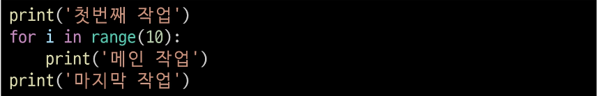
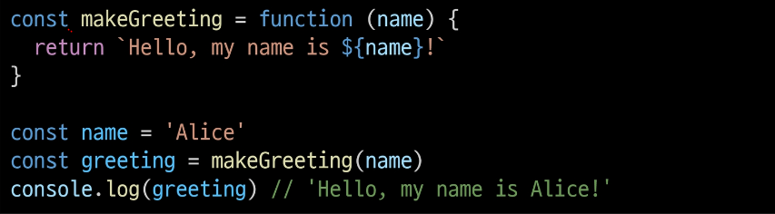
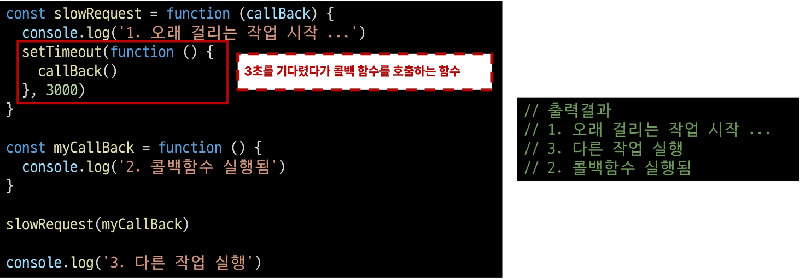
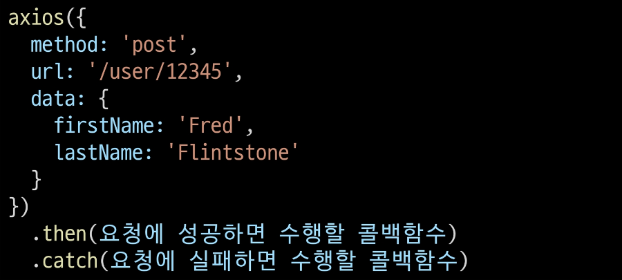

### 목차
[비동기]
[JavaScrpt와 비동기]
[AJAX]
[Callback과 Promise]

### Synchronous(동기)
- 프로그램의 실행흐름이 순차적으로 진행
  - 하나의 작업이 완료된 후에 다음 작업이 실행되는 방식
  - 주문 후 내 전 주문 커피가 모두 나올 때까지 기다리는 방식
- 예시
  1. 메인 작업이 모두 수행되어야 마지막 작업이 수행됨
    
  2. 함수의 작업이 완료될 때까지 기다렸다가 값을 반환해야 계속 진행 가능(동기함수)
    

### Asynchronous(비동기)
- 프로그램의 실행 흐름이 순차적이지 않으며, 작업이 완료되기를 기다리지 않고 다음 작업이 실행되는 방식
  - 작업의 완료 여부를 신경 쓰지 않고 동시에 다른 작업 수행 가능 
  - 주문 후 만들어진 순서대로 진동 벨이 울리면 커피 받는 방식

#### Asynchronous 특징
- 병렬적 수행
- 당장 처리를 완료할 수 없고 시간이 필요한 작업들은 별도로 요청을 보낸 뒤 응답이 빨리 오는 작업부터 처리
- 예시
  1. Gmail에서 메일 전송을 눌면 목록 화면으로 전환되지만 실제로 메일을 보내는 작업은 병렬적으로 별도로 처리
  2. 브라우저는 웹페이지를 먼저 처리되는 요소부터 그려 나가며 처리가 오래 걸리는 것들은 별도로 처리가 완료되는대로 병렬적으로 처리
  3. 

### JavaScipt와 비동기
- Single Thread언어, JavaScript
- Thread
  - 작업을 처리할 때 실제로 작업을 수행하는 주체로 multi-thread라면 업무를 수행할 수 있는 주체가 여러 개라는 의미
- JavaScript는 한번에 여러 일 수행 불가
  - JavaScript는 한 번에 하나의 일만 수행 할 수 있는 Single Thread언어로 동시에 여러작업 불가
  - 하나의 작업을 요청한 순서대로 처리
- JavaScript Runtime
  - JavaScript가 동작할 수 있는 환경(Runtime)
  - JavaScript자체는 Single Thread이므로 비동기 처리를 할 수 있도록 도와주는 환경 필요
  - 비동기와 관련한 작업은 '브라우저'또는 'Node'와 같은 환경에서 처리

#### 브라우저 환경에서의 JavaScript 비동기 처리 관련 요소
1. JavaScript Engine의 Call Stack 
  - 요청이 들어올 때 마다 순차적으로 처리하는 Stack(LIFO)
  - 기본적인 JavaScript의 Single Thread작업 처리
2. Web API 
  - JavaScript 엔진이 아닌 브라우저에서 제공하는 runtime 환경
  - 시간이 소요되는 작업을 처리(setTimout, DOM Event, AJAX 요청 등)
3. Task Queue 
  - 비동기 처리된 Callback 함수가 대기하는 Queue(FIFO)
4. Event Loop 
  - 태스크(작업)가 들어오길 기다렸다가 태스크가 들어오면 이를 처리, 처리할 태스크가 없는 경우엔 잠드는, 끊임없이 돌아가는 자바스크립트 내 루프
  - Call Stack과 Task Queue를 지속적으로 모니터링
  - Call Stack이 비어있는지 확인 후 비어 있다면 Task Queue에서 대기중인 오래된 작업을 Call Stack으로 Push

#### 브라우저 환경에서의 JavaScript 비동기 처리 동작 방식
1. 모든 작업은 Call Stack (LIFO)으로 들어간 후 처리
2. 오래 걸리는 작업이 Call Stack으로 들어오면 Web API 로 보내 별도로 처리
3. Web API에서 처리가 끝난 작업들은 곧바로 Call Stack으로 들어가지 못하고 Task Queue (FIFO)에 순서대로 들어감
4. Event Loop 가 Call Stack이 비어 있는 것을 계속 체크, Call Stack이 빈다면 Task Queue에서 가장 오래된(가장 먼저 처리되어 들어온)작업을 Call Stack으로 보냄

### AJAX
- Asynchronous JavaScript + XML
- JavaScript의 비동기 구조와 XML객체를 활용해 비동기적으로 서버와 통신하여 웹페이지의 일부분만을 업데이트하는 웹 개발 기술
- X가 XML을 의미하긴 하지만 요즘은 더 가벼운 용량과 JavaScript의 일부라는 장점 때문에 **JSON**을 더 많이 사용

#### XMLHttpRequest 객체
- 서버와 상호작용할 때 사용하며 페이지의 새로고침 없이도 URL에서 데이터를 가져올 수 있음
- 사용자의 작업을 방해하지 않고 페이지의 일부를 업데이트
- 주로 AJAX 프로그래밍에 많이 사용

### Axios
- JavaScript에서 사용되는 HTTP 클라이언트 라이브러리
- 서버와의 HTTP 요청과 응답을 간편하게 처리할 수 있도록 도와주는 도구

#### Axios 구조
- get, post 등 여러 http request method 사용가능
- then 메서드를 사용해서 '성공하면 수행할 로직'을 작성
- catch 메서드를 사용해서 '실패하면 수행할 로직'을 작성
- 