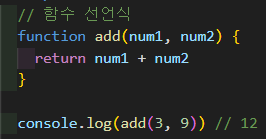
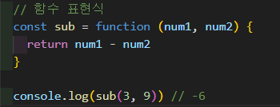
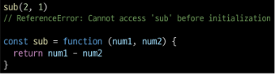

### 목차
- [함수]
- [객체]
- [배열]

### 함수
- Function: 참조 자료형에 속하며 모든 함수는 Function object
- 데이터 타입
  - 원시 자료형(Primitive type)
    - 변수에 값이 직접 저장되는 자료형(불변, 값이 복사)
    - Number, String, Boolean, undefined, null
  - 참조 자료형(Reference type)
    - 객체의 주소가 저장되는 자료형(가변, 주소가 복사)
    - Objects(object, Array, Function)
#### 함수 구조
- 함수의 이름
- 함수의 매개변수
- 함수의 body를 구성하는 statement
* return 값이 없다면 undefined를 반환

#### 함수 정의 방법
- 선언식(function declaration)
  - 
  ```js
  // 함수 선언식
  function add(num1, num2) {
    return num1 + num2
  }

  console.log(add(3, 9)) // 12
  ```
- 표현식(function expression)
  - 
  - 함수 이름이 없는 '익명 함수' 사용가능
  - 선언식과 달리 표현식으로 정의한 함수는 호이스팅 되지 않으므로 함수를 정의하기 전에 먼저 사용 불가
  - 