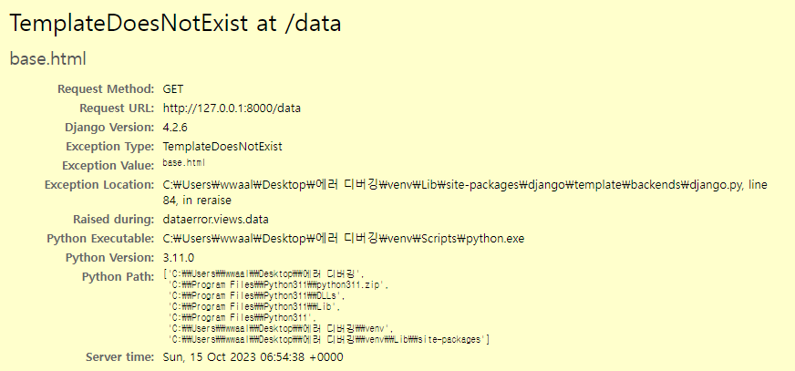
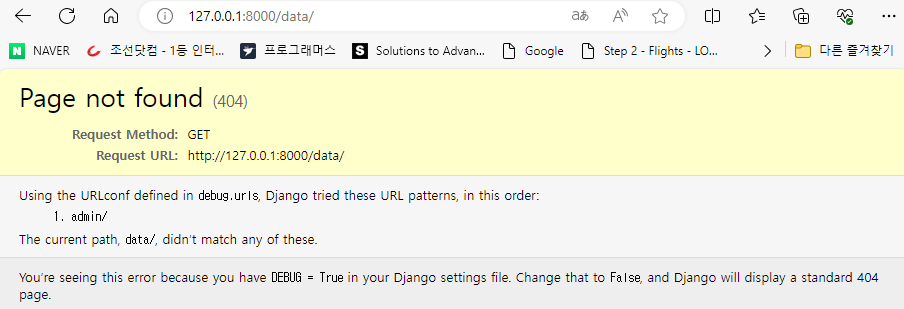
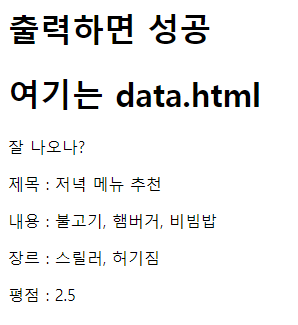
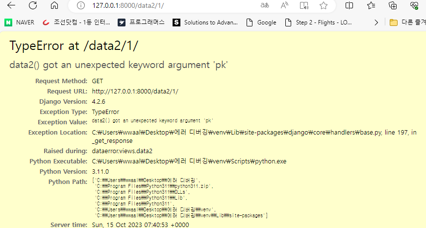
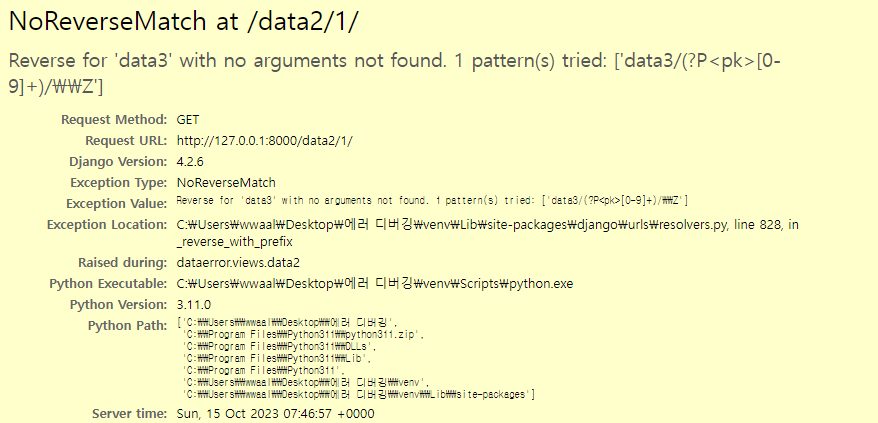
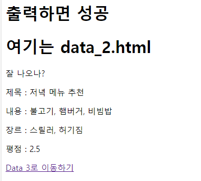

# 시작하기

 1. 파이썬 가상환경 설치
 2. requirements 설치

# Template 설정

 

 - data.html / data_2.html 에 base.html이 적용되지 않는 문제 해결하기

 

 

 - 위 그림과 같이 나올 수 있도록 해결

# Dataerror

 

 - 위 오류 해결해보기

### DB 생성 후 python manage.py loaddata test.json 명령어 실행으로 DB에 값 추가하기

 

 - 현재 위와 같은 상황이고 DB에 는 값이 제대로 들어가 있지만 데이터가 안나오는 상황(혹은 일부만) 해결해보기

 

### Data2 접속 오류

 

 - data2에 주어진 양식대로 접속을 할려고 url 입력시 페이지에 오류가난 거 해결
 - 위 문제를 해결하면 다음 문제 해결해보기

 

 

 