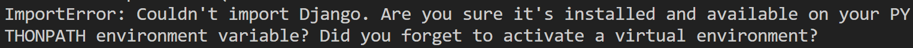
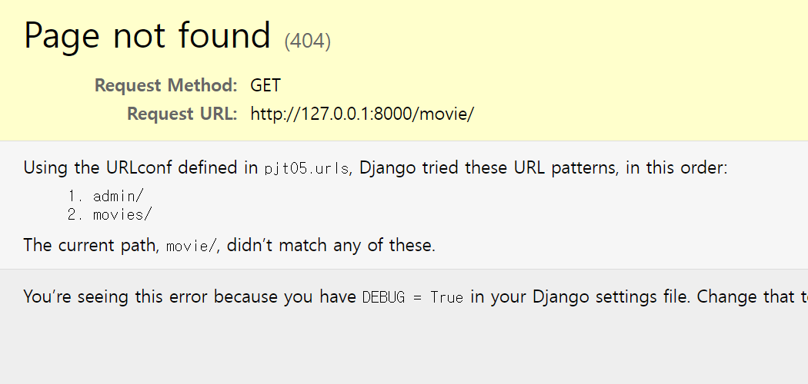
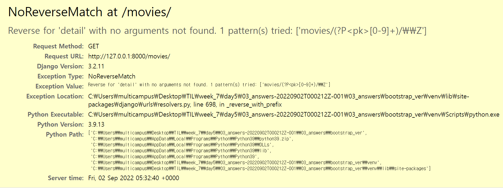
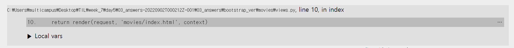
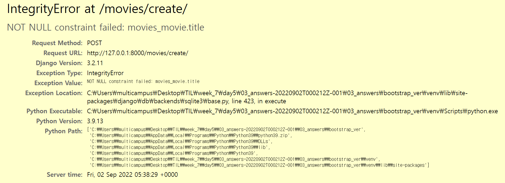
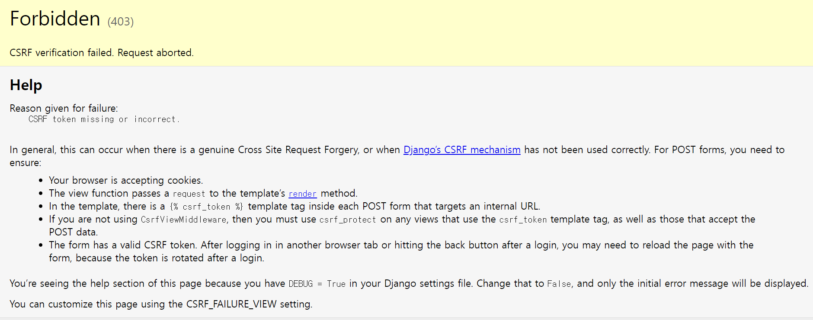

# 자주 나는 에러

## 1. Couldn't import Django

- `python manage.py runserver` 명령어 입력 시 장고를 찾지 못한다는 에러 발생
- 해결 방법
1. 가상 환경이 활성화 되어있는 지 확인
2. `pip list` 입력 시 `django` 가 잘 설치되어 있는 지 확인

 

 

## 2. 사이트에 연결할 수 없음

- 서버가 켜지지 않았을 때 발생
- 해결 방법
1. `python manage.py runserver` 를 통해 서버 open

 

 

## 3. Page not found (404)

- 요청한 URL 에 해당하는 경로가 존재하지 않음
- 해결 방법
1. 주소창 URL 경로 입력에 오타가 있는 지 확인
2. project urls.py -> app urls.py 따라가면서 경로를 정확히 설정하였는 지 확인

 

 

## 데이터 출력

### 4. 데이터가 일부만 출력되는 경우

- 데이터가 일부만 출력이 됨
- 해결 방법
1. 50% 오타 ( templates 확인 )
2. 50% 데이터가 안들어옴
    - views.py 에서 데이터를 넘기기 전 print 해보기
    - None 이 뜬다면 데이터가 안들어왔다는 의미
    - 이럴 경우, DB 에 데이터가 존재하는지 확인
        - 존재 한다면, DB 에서 읽어올 때 오타 확인
        - 존재하지 않는다면, DB 에 데이터 입력하는 부분에서 에러

### 5. 데이터가 모두 출력되지 않는 경우

1. views.py 에서 데이터를 넘기지 않은 경우
   - context 에 묶어줄 때 오타가 없는 지 확인해야 한다.
2. views.py 에서 DB 에서 데이터를 읽어오는 코드가 잘못된 경우
3. DB 에 데이터가 없는 경우

 

 

## 6. NoReverseMatch

- Template 에서 사용한 `` 구문에서 __매칭되는 url pattern 이 없다는 의미__
- 해결 방법
1. 에러가 나는 template 를 찾는다
    - 사진 기준으로 `detail` url 을 사용하는 부분을 찾아야 함 
    - 아래로 내려보면 views.py 에서 랜더링 할 때 에러가 난다고 나옴
    - 
    - 위 사진 기준으로 `index.html` 랜더링 시 에러이므로, index.html 파일을 수정해야 함
2. 해당 template 에서 에러가 발생한 `url 태그` 를 찾는다.
3. 해당 url 패턴을 urls.py 에서 선언한 패턴과 일치하도록 수정한다.

 

 

## 7. IntegrityError

- 번역하면: `무결성 에러`
- 해석하면: DB 에 데이터를 넣어야 하는데, 너의 데이터가 문제가 있어 !
    - 대부분의 경우 NULL 값을 전달한 경우 발생
- 해결 방법
1. 입력한 데이터가 정상적으로 `view` 로 넘어왔는 지 확인
    - views.py 에서 print 문 작성하면 보인다.
2. `template` 에서 오타 확인
    - 변수 이름에서 오타가 났을 확률이 높다
3. Model 에서 Field type 과 비교
    - `IntegerField` 에 문자열을 삽입하려고 시도하는 경우 등

 

 

## 8. CSRF token

- CSRF 공격 : 사용자가 원하는 행동과 관계없는 행동을 하게 만드는 공격
- 강의 시간에 옥션을 예시로 하였습니다
    - 이메일에 관리자 계정을 변경하는 URL 요청을 안보이게 삽입
- 해결 방법
    - POST 하는 form 에 `` 추가

