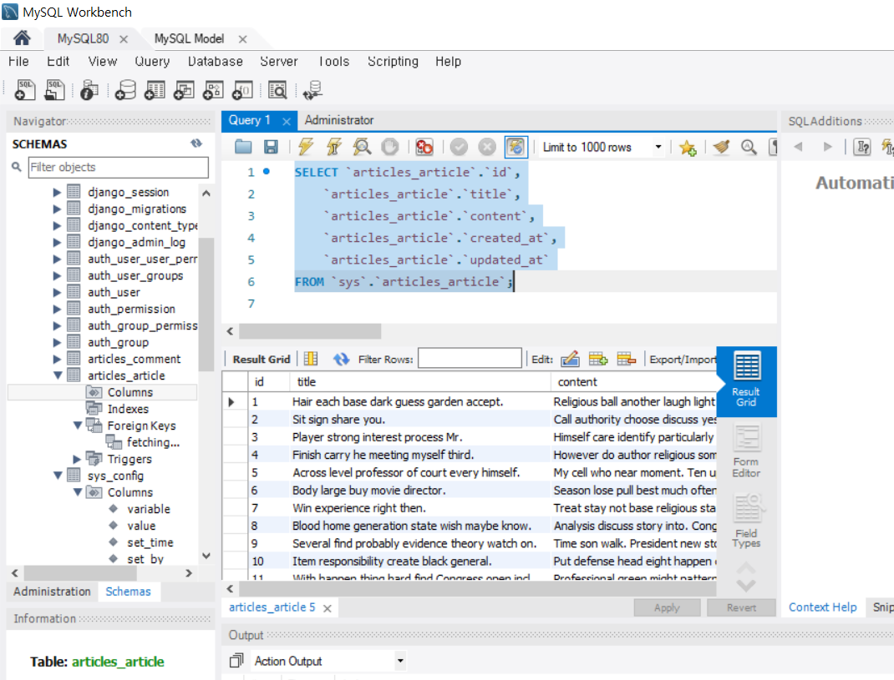
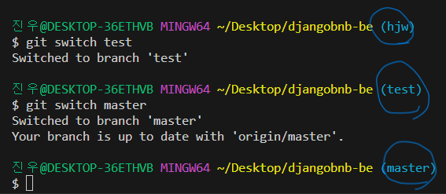
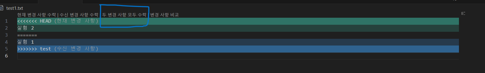
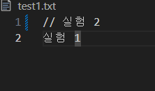

# 1주차

- [1주차](#1주차)
  - [백엔드 기술 선택](#백엔드-기술-선택)
    - [백엔드 스택 종류](#백엔드-스택-종류)
      - [Spring](#spring)
      - [Django](#django)
      - [Node.js](#nodejs)
  - [django 5.0 release](#django-50-release)
  - [mySQL과 django](#mysql과-django)
    - [MySQL](#mysql)
      - [장단점](#장단점)
    - [django와 연동](#django와-연동)
  - [Git협업관련](#git협업관련)
    - [기본적인 이용사항](#기본적인-이용사항)


## 백엔드 기술 선택
- 프로젝트 진행을 위해 어떤 기술스택(백엔드 프레임워크)를 선택을 할지 고민
- 해보고 싶은 것(공부), 할 수 있는 것(응용 및 심화)
### 백엔드 스택 종류
- 3가지 스택 중 고려
- Spring, Django, node.js
- ~~어떤 프레임워크를 선택하더라도 지장이 있는 경우는 없다는 컨설턴트님의 조언~~
- ~~어떤 이유로 고를지 고민~~
#### Spring
- Java기반 프레임워크

- 장점
  - 종합적인 생태계: 다양한 모듈과 라이브러리 존재
  - 다양한 커뮤니티: Java를 널리 사용되므로, 커뮤니티 지원이 풍부
  - 강력한 DI와 IoC 컨테이너: 의존성 주입과 제어의 역전 기능 존재로 느슨한 결합을 촉진하며 테스트 용이성이 높음
- 단점
  - 러닝 커브: 다양한 기능과 설정으로 인해 초기 학습의 어려움
  - XML 설정의 복잡성: XML을 사용하는 설정이 많아 가독성이 떨어지고 설정 오류 발생 가능성

#### Django
- Python 기반 프레임워크

- 장점
  - 단일화된 프레임워크: 데이터베이스 모델, URL, 뷰, 템플릿 등을 통합하여 제공하므로 개발자들이 일관된 방식으로 애플리케이션 개발가능
  - 빠른 개발: 개발 생산성을 높이기 위한 다양한 기능을 제공
  - ORM(객체 관계 매핑) 지원: ORM을 통해 데이터베이스와 상호작용 가능
- 단점
  - 성능 한계: 대규모 애플리케이션에서 성능이 중요한 경우 제한
  - 유연성 한계: 고정된 구조로 인한 유연성 제한

#### Node.js
- JavaScript 기반 프레임워크

- 장점
  - 단일 언어 사용: 프론트엔드와 백엔드 개발을 모두 가능
  - 비동기 프로그래밍: 이벤트 기반 및 비동기 프로그래밍을 지원 ->  높은 성능
  - 대용량 실시간 애플리케이션: 실시간 웹 소켓과 같은 기능을 사용, 대규모 실시간 애플리케이션 적합
- 단점
  - 단일 스레드 모델: CPU 집약적인 작업에는 적합 X
  - 콜백 지옥(Callback Hell): 비동기 프로그래밍에서 콜백 중첩 발생 가능성 존재
  - 생태계의 다양성과 불안정성: 생태계는 매우 다양하지만, 버전 충돌이나 라이브러리의 안정성 문제 존재


## django 5.0 release
- python 호환성
  -  Python 3.10, 3.11 , 3.12
- 백엔드 변화점
  - 모델의 default값에 계산된 값 할당 가능
  ```py
  # 예시
  from django.db import models
  from django.db.models.functions import Now, Pi


  class MyModel(models.Model):
    age = models.IntegerField(db_default=18)
    created = models.DateTimeField(db_default=Now())
    circumference = models.FloatField(db_default=2 * Pi())
  ```
  - 다른 필드에서 계산되는 필드 생성 가능
  ```py
  from django.db import models
  from django.db.models import F


  class Square(models.Model):
    side = models.IntegerField()
    # area 필드는 계산값 사용
    area = models.GeneratedField(
        expression=F("side") * F("side"),
        output_field=models.BigIntegerField(),
        db_persist=True,
    )
  ```
  - 모델 필드의 변화
      - Field.choices, ChoiceField.choices
      - 이전 버전의 장고 
        - 2-튜플의 리스트나 Enumeration 타입의 서브클래스만을 지원
      - 현재 버전의 장고
        - iterable객체가 아니어도 가능
        - 열거형(Enumeration) 타입을 확장시 .choices없이 바로 가능
        - callable 가능
  - 유연성 증가
  ```py
  ## 과거버전
  from django.db import models

  Medal = models.TextChoices("Medal", "GOLD SILVER BRONZE")

  SPORT_CHOICES = [
      ("Martial Arts", [("judo", "Judo"), ("karate", "Karate")]),
      ("Racket", [("badminton", "Badminton"), ("tennis", "Tennis")]),
      ("unknown", "Unknown"),
  ]


  class Winner(models.Model):
    name = models.CharField(...)
    medal = models.CharField(..., choices=Medal.choices)
    sport = models.CharField(..., choices=SPORT_CHOICES)
  ```

  ```py
  # 현재버전
  from django.db import models

  Medal = models.TextChoices("Medal", "GOLD SILVER BRONZE")

  SPORT_CHOICES = {  # list of 2-tuples이 아니더라도 가능
      "Martial Arts": {"judo": "Judo", "karate": "Karate"},
      "Racket": {"badminton": "Badminton", "tennis": "Tennis"},
      "unknown": "Unknown",
  }


  def get_scores():
      return [(i, str(i)) for i in range(10)]


  class Winner(models.Model):
      name = models.CharField(...)
      medal = models.CharField(..., choices=Medal)  # .choices 더 이상 필요 x
      sport = models.CharField(..., choices=SPORT_CHOICES)
      score = models.IntegerField(choices=get_scores)  # callable 가능
  ```


## mySQL과 django

### MySQL
- 널리 사용되는 오픈 소스 관계형 데이터베이스 관리 시스템
- SQL을 사용하여 구조화된 방식으로 데이터를 효율적으로 저장, 검색 및 조작하도록 설계
- 안정성, 신뢰성 및 사용 용이성으로 인해 웹 애플리케이션, 데이터 웨어하우징 및 로깅에 널리 사용
- 여러 플랫폼을 지원하며 다중 사용자 액세스, 보안, 백업 및 복구 옵션과 같은 기능 제공
- 까다로운 응용 프로그램에 확장성과 고성능을 제공하는 고도로 사용자 정의 가능한 데이터베이스 시스템

#### 장단점
- 장점
  - 오픈 소스: 오픈 소스 소프트웨어이므로 자유롭게 사용, 배포 및 수정할 수 있으므로 많은 조직에서 경제적인 솔루션으로 사용
  - 널리 사용: 가장 널리 사용되는 관계형 데이터베이스 관리 시스템 중 하나, 지원 및 리소스를 제공하는 대규모 사용자 커뮤니티 존재
  - 확장성: 확장성이 뛰어나도록 설계되어 많은 양의 데이터 저장 및 처리가 필요한 성장하는 조직 및 애플리케이션에 매우 적합
  - 성능: 높은 성능으로 트래픽이 많은 웹사이트, 온라인 애플리케이션 및 데이터 집약적 애플리케이션에 적합
  - 사용 용이성: 사용자 친화적, 간단한 설정 프로세스를 통해 개발자가 프로젝트 쉽게 접하고 통합 가능

- 단점:
  - 제한된 트랜잭션: MySQL은 다른 RDBMS 시스템에 비해 트랜잭션 기능이 제한, 복잡한 트랜잭션이 필요한 애플리케이션에는 적합 X
  - NoSQL에 대한 지원 부족: MySQL은 기본 NoSQL 애플리케이션에 사용은 가능하지만, 다른 데이터베이스와 같은 강력한 NoSQL 기능 존재 X
  - 보안 문제: MySQL에는 수년 동안 몇 가지 보안 취약점이 있어 민감한 데이터에 대한 위험을 초래할 수 있으며 추가 보안 조치 필요
  - 기본 그래프 데이터베이스 지원 부족: MySQL은 복잡한 데이터 관계에 대해 점점 더 대중화되고 있는 그래프 데이터베이스를 기본적으로 지원 X
  - 복잡한 관리: MySQL 관리는 특히 트래픽이 많은 대규모 데이터베이스 및 애플리케이션의 경우 복잡할 수 있으며 숙련된 실력 필요

### django와 연동
- 기존 django에서는 sqlite3 db를 사용
- AWS의 RDS에서는 sqlite3 지원 X
- mySQL은 지원하므로 django의 기본 db를 mySQL과 연동
- 추후 회원관리는 radis사용 예정

1. Python에서 MySQL 서버와 통신을 할 수 있게 해주는 파이썬 용 데이터베이서 커넥터(Databaser Connector) 설치
   -  pymsql나 mysqlclient 둘 중 하나만 설치(mysqlclient 권장)
   ```
   pip install mysqlclient
   ```
2. settings.py 설정
- django project의 manage.py가 있는 디렉토리에 my_settings.py 파일 생성
- my_setting.py 설정
```py
#my_settings.py
DATABASES = {
    'default': {
        'ENGINE': 'django.db.backends.mysql', #1 사용할 엔진
        'NAME': 'sys', #2 연동할 mySQL 데이터베이스 이름
        'USER': 'root', #3 DB접속 계정명      
        'PASSWORD': '비밀번호',  #4  해당 db접속 계정 비밀번호            
        'HOST': 'localhost',   #5 실제 db주소         
        'PORT': '3306', #6 포트번호
    }
}
SECRET_KEY ="기존 settings.py에 있는 시크릿키"
```
```py
#  my_settings불러오기
import my_settings
# 기존 databases, secret_key를 my_settgins설정 값으로 설정
DATABASES = my_settings.DATABASES
SECRET_KEY = my_settings.SECRET_KEY
```
- mySQL연동 후 db확인
- 


## Git협업관련
- 분산 버전 관리 시스템(Distributed Version Control System, DVCS)
- 병렬 개발 및 동시 작업 가능: 브랜치 사용
- 이력 추적과 롤백: 오류가 생긴 시점을 알 수 있으며, 롤백으로 인해 오류 잡기에 용이

### 기본적인 이용사항
1. 자신의 branch 만들기(여기서 작업), 처음 master branch에 있는 commit 및 log를 가져오며 새로운 branch만들기
   - git branch **name** master ('name'은 자신이 정하는 이름)
   - git branch : 모든 branch확인
2. git switch **name** (bash에서 자신이 정한이름으로 바뀌었는지 확인)
   - 
   - 여기서 작업해야함 master에서 작업하다가 날라가면 ㅠ
3. git branch -d **name** :  merge작업이 끝난 branch삭제
4. git branch -D **name** :  강제 branch삭제

5. master branch에 적용 안하고 자신의 작업만 깃허브에 저장하고 싶을 경우
   - git add .
   - git commit -m ''
   - git push origin **name**
   - 이 과정은 **자신의 branch**에서

   
6. 자신의 branch에서 작업한 후 master branch에 변경사항 적용하고 싶은 경우
   1. 방법 1 (브랜치에서 작업한 것이 맞는지 확인후 master에 변경사항을 적용하는것이 좋음)
        1. git add .
        2. git commit -m ' '
        3. git push origin **name** -> master로 보내지 않음 자신의 브랜치에 수정사항 올림
        4. 깃허브 홈페이지에서 마스터 브랜치에 최종 변경사항 적용
        5. 
        6. 바로 적용하는 것이 아닌**꼭꼭 상의**
   2. 방법 2 (변경사항이 확실할시 올리는것도 가능하나 왠만하면 확인후 master에 올리는 과정 필요)
        1. git add .
        2. git commit -m '컨벤션규칙에 따라 작성'
        3. git switch master : 마스터 브랜치로 이동한후
        4. git merge **name** (이작업은 브랜치에서의 변경사항을 master로컬에 적용하는 과정)
        5. git add . /git commit -m '' /git push origin **master** 작업을 거쳐야 깃허브에 등록

7. **name**의 경우 자신의 브랜치를 뜻하며 master branch에 변경을 할시 팀원에게 알리는 과정이 필요하며 master의 변경사항이 있을때마다 pull해 오는 과정이 중요하므로 항시 master의 변경사항이 존재할시 팀원과 얘기!
  - master branch에 변경사항이 있을시
    1. git pull origin master
    2. git switch **name**
    3. master의 변경사항 받아오는 방법
       1. git merge master  
       2. git rebase master
       3. 두가지 모두 꼭 master에서 변경사항이 아니라 다른 branch에서도 가지고 올 수 있음
      - 두가지의 차이점이 존재하나 아직 확실히 알고 난 이후 수정

- **주의사항**

  - 절대로 작업을 **master branch**에서 하지 않기
  - 같은 파일을 작업시에 다음과 같은 상황이 발생할 수 있음   

    
  - 하나만 받는것이 아닌 두개다 받은 이후 주석처리 혹은 다른 메모장에 작성해 둔 후 추후 팀원과 상의   
    
  - 삭제를 해버릴 시에 다른 쪽 코드에서 오류가 발생할 수 있음


