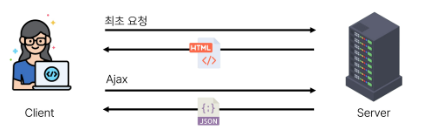
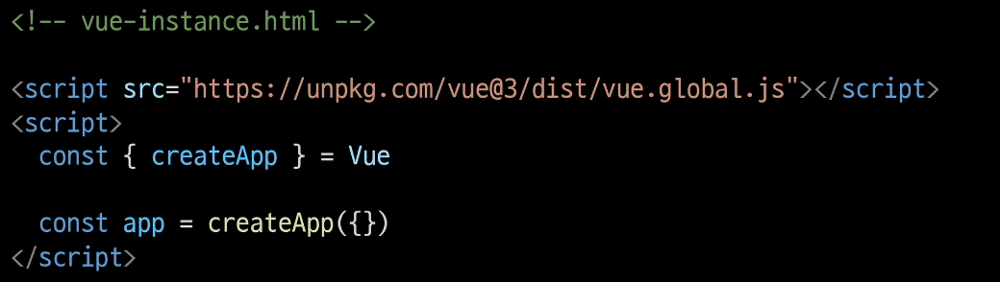
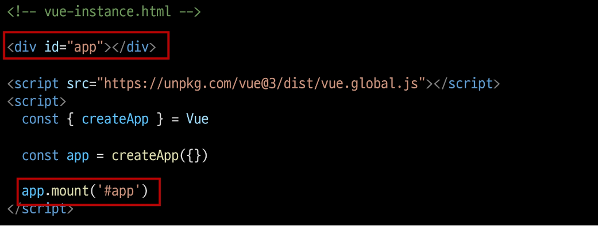
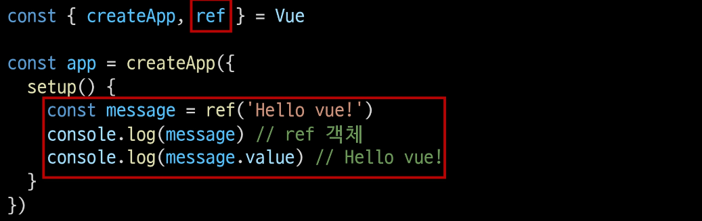
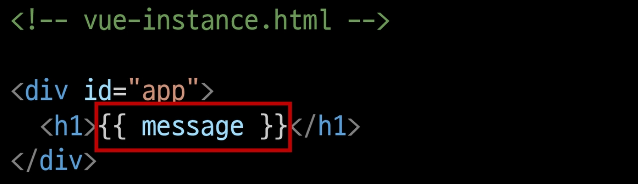

### 목차
[Front-end Development]
[Vue]

### Front-end Development
- 웹사이트와 웹 애플리케이션의 사용자 인터페이스(UI)와 사용자 경험(UX)을 만들고 디자인하는 것
- HTML, CSS, JavaScript 등을 활용하여 사용자가 직접 상호작용하는 부분을 개발

#### Client-side Frameworks
- 클라이언트 측에서 UI와 상호작용을 개발하기 위해 사용되는 JavaScript 기반 프레임 워크

- 필요한 이유 1
  - 웹의 역할: 단순히 무언가를 읽는 곳 -> 무언가를 하는 곳
  - 사용자는 이제 웹에서 문서만을 읽는 것이 아닌 음악을 스트리밍하고, 영화를 보고, 원거리에 있는 사람들과 텍스트 및 영상 채팅을 통해 즉시 통신하고 있음
  - 이처럼 현대적이고 복잡한 대화형 웹 사이트를 **웹 에플리케이션** 이라 부름
  - JavaScript 기반의 Client-side Frameworks의 출현으로 매우 동적인 대화형 애플리케이션을 훨씬 더 쉽게 구축할 수 있게 됨
- 필요한 이유 2
  - 다루는 데이터가 많아짐
  - 만약 친구가 이름을 변경했다면
    - 친구 목록, 타임라인, 스토리 등 친구이름이 출력되는 모든 곳이 함께 변경되어야 함
  - 애플리케이션의 기본 데이터를 안정적으로 추적하고 업데이트(렌더링, 추가, 삭제 등) 하는 도구가 필요
  - 애플리 케이션의 **상태를 변경**할 때마다 **일치하도록 UI를 업데이트**해야 함

#### SPA(Single Page Application)
- 페이지 한 개로 구성된 웹 애플리케이션
- 
1. 서버로부터 필요한 모든 정적 HTML을 처음에 한번 가져옴
2. 브라우저가 페이지를 로드하면 Vue 프레임워크는 각 HTML요소에 적절한 JavaScript 코드를 실행(이벤트응답, 데이터 요청후 UI업데이트 등)
  - ex) 페이지 간 이동시, 페이지 갱신에 필요한 데이터만을 JSON으로 전달받아 페이지 일부 갱신
  - Google Maps, 인스타그램 등의 서비스에서 갱신 시 새로고침이 없는 이유
- 웹 애플리케이션의 초기 로딩 후 새로운 페이지 요청 없이 동적으로 화면을 갱신 하며 사용자와 상호작용하는 웹 애플리케이션
  - CSR 방식
#### CSR(Client-side Rendering)
- 클라이언트에서 화면을 렌더링 하는 방식
- (다른 방식 SSR)
1. 브라우저는 페이지에 필요한 최소한의 HTML페이지와 JavaSript를 다운로드
2. JavaScript를 사용하여 DOM을 업데이트하고 페이지를 랜더링

#### CSR의 장점
1. 빠른속도
  - 페이지의 일부를 다시 랜더링할 수 있으므로 동일한 웹 사이트의 다른 페이지로 이동하는 것이 일반적으로 더 빠름
  - 서버로 전송되는 데이터의 양을 최소화
2. 사용자 경험
  - 새로고침이 발생 X -> 네이티브 앱과 유사한 사용자 경험을 제공
3. Front-end와 Back-end의 명확한 분리
  - Front-end: UI랜더링 및 사용자 상호 작용 처리
  - Back-end: 데이터 및 API제공
  - 대규모 애플리케이션을 더 쉽게 개발하고 유지 관리 가능

#### CSR의 단점
1. 초기 구동속도가 느림
  - 전체 페이지를 보기전에 약간의 지연 존재
  - JavaScript가 다운로드, 구문 분석 및 실행될 때까지 페이지가 완전히 랜더링 X
2. SEO(검색 엔진 최적화)문제
  - 페이지를 나중에 그려 나가는 것이기 때문에 검색에 잘 노출 X
  - [SEO 참고](#seosearch-engine-optimiztion)

### Vue
- 사용자 인터페이스를 구축하기 위한 JavaSript 프레임워크
- 현재 Vue3가 최신 버전
  - Vue 2 공식문서에 접속하지 않도록 주의

#### Vue의 특징
1. 쉬운 학습 곡선 및 간편한 문법
  - 새로운 개발자들도 빠르게 학습가능
2. 반응성 시스템
  - 데이터 변경에 따라 자동으로 화면이 업데이트 되는 기능 제공
3. 모듈화 및 유연한 구조
  - 애플리케이션을 컴포넌트 조각으로 나눌 수 있음
  - 코드의 재사용을 높이고 유지보수 용이

#### Vue의 2가지 핵심기능
1. 선언적 랜더링(Declarative Rendering)
  - HTML을 확장하는 템플릿 구문을 사용하여 HTML이 JavaScript 데이터를 기반으로 어떻게 보이는지 설명 가능
2. 반응형(Reactivity)
  - JavaScript 상태 변경사항을 자동으로 추적하고 변경사항이 발생할 때 DOM을 효율적으로 업데이트

#### Vue 사용
- Vue 작성
  - CDN 및 Application instance 작성
  - 
  - Application instance
    - 모든 Vue 애플리케이션은 createApp 함수로 새 Application intance를 생성하는 것으로 시작
  - app.mount()
    - 컨테이너 요소에 애플리케이션 인스턴스를 탑재(연결)
    - 각 앱 인스턴스에 대해 mount()는 한번만 호출 가능
  - 
- ref() (wrapping 과정)
  - 반응형 상태(데이터)를 선언하는 함수
    - 반응형을 가지는 참조 변수를 만드는 것
    - ref === reactive refernce
  - Declaring Reactive State
  - [ref유무 차이](./01-introduction-of-vue/99-ref-vs-variable.html)
  - 인자를 받아 .value 속성이 있는 ref객체로 래핑(wrapping)하여 반환
  - ref로 선언된 변수의 값이 변경되면, 해당 값을 사용하는 템플릿에서 자동으로 업데이트
  - 인자는 어떠한 타입도 가능
  - 
  - 템플릿의 참조에 접근하려면 setup함수에서 선언 및 반환 필요
  - 템플릿에서 ref를 사용할 때는 .value를 작성할 필요 없음
  - 
#### Vue 기본 구조
- createApp()에 전달 되는 객체는 Vue컴포넌트(Component)
- 컴포넌트 상태는 setup() 함수 내에서 선언되어야 하며 **객체를 반환**해야 함
- 반환된 객체의 속성은 템플릿에서 사용 가능
- 콧수염 구문({{ }})을 사용하여 메시지 값을 기반으로 동적 텍스트를 렌더링
- 콘텐츠는 식별자나 경로에만 국한되지 않으며 유효한 JavaScript 표현식을 사용할 수 있음
- ex) 
- [JavaScript 표현식](./01-introduction-of-vue/03-event-listener.html)

### 참고
#### SEO(search Engine Optimiztion)
- google, bing과 같은 검색 엔진 등에 내 서비스나 제품 등이 효율적으로 검색 엔진에 노출되도록 개선하는 과정을 일컫는 작업
- 정보의 대상은 주로 HTML에 작성된 내용
- 검색
  - 각 사이트가 운용하는 검색 엔진에 의해 이루어지는 작업
- 검색 엔진
  - 웹 상에 존재하는 가능한 모든 정보들을 긁어 모으는 방식으로 동작
- 최근에는 SPA, 즉 CSR로 구성된 서비스의 비중이 증가
- SPA 서비스도 검색 대상으로 넓히기 위해 JS를 지원하는 방식으로 발전 중
