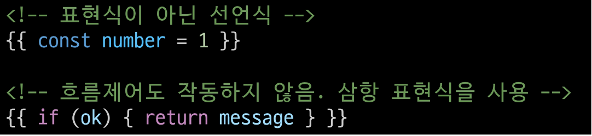

## 목차
- [Template Syntax]()
- [Dynamically data binding]()
- [Event Handling]()
- [Form Input Bindings]()

### Template Syntax
- DOM을 기본 구성 요소 인스턴스의 데이터에 선언적으로 바인딩할 수 있는 확장된 문법을 제공하는 HTML 기반 템플릿 구문을 사용 

#### Template Syntax 종류
1. Text Interpolation
    - 
    - 데이터 바인딩의 가장 기본적인 형태
    - 이중 중괄호 구문 (콧수염 구문)을 사용
    - 콧수염 구문은 해당 구성 요소 인스턴스의 msg 속성 값으로 대체
    - msg 속성이 변경될 때마다 업데이트 됨
2. Raw HTML
    # 사진
    - 콧수염 구문은 데이터를 일반 텍스트로 해석하기 때문에 실제 HTML을 출력하려면 v-html을 사용해야 함
3. Attribute Bindings
    - # 사진
    - 콧수염 구문은 HTML 속성 내에서 사용할 수 없기 때문에 v-bind를 사용
    - HTML의 id 속성 값을  vue의 dynamicid속성과 동기화 되도록 함
    - 바인딩 값이 null이나 undefind인 경우 렌더링 요소에서 제거됨
4. JavaScript Expressions
    - # 사진  
    - vue는 모든 데이터 바인딩 내에서 JavaScipt 표현식의 모든 기능을 지원
    - vue템플릿에서 JavaScript표현식을 사용할 수 있는 위치
      - 콧수염 구문 내부
      - 모든 directive의 속성 값(v-로 시작하는 특수 속성)

#### Expressions 주의사항
- 각 바인딩에는 하나의 단일 표현식만 포함될 수 있음
  - 표현식은 값으로 평가할 수 있는 코드 조각(return 뒤에 사용할 수 있는 코드여야 함)
- 작동하지 않는 경우
  - 

### Directive
- **v-**접두사가 있는 특수 속성
- Directive의 속성 값은 단일 Javascript표현식이어야 함(v-for, v-on제외)
- 표현식 값이 변경될 때 DOM에 반응적으로 업데이트를 적용
- 예시
  - v-if는 seen표현식 값의 T/F를 기반으로 
요소를 제거/삽입
  - # 사진

#### Directive - Arguments
- 일부 directive는 directive 뒤에 콜론(:)으로 표시되는 인자를 사용할 수 있음
- 아래 예시의 href는 HTML a요소의 href속성 값을 myURL 값에 바인딩 하도록 하는 v-bind의 인자
- # 사진
- 아래 예시의 click은 이벤트 수신할 이벤트 이름을 작성하는 v-on의 인자
- # 사진

#### Directive - Modifiers
- .(dot)로 표시되는 특수 접미사로, directive가 특별한 방식으로 바인딩되어야 함을 나타냄
- 예를 들어 .prevent는 발생한 이벤트에서 event.preventDefault()를 호출하도록 v-on에 지시하는 modifier
- # 사진
- [Vue-built-in-Directives-문서](https://vuejs.org/api/built-in-directives.html)

### Dymically data binding
- 동적 데이터 연결
- 데이터를 연결하고 나서 데이터가 변경이 되었을 때 자동으로 HTML도 업데이트 되도록 하는 것
### v-bind
- 하나 이상의 속성 또는 컴포넌트 데이터를 표현식에 동적으로 바인딩
- 사용처
  - Attribute Bindings
  - Class and Style Bindings

#### Attribute Bindings
- HTML의 속성 값을 Vue의 상태 속성 값과 동기화 되도록 함
- # 사진
- v-bind shorthand
  - ':' (colon)
  - # 사진
- Dynamic attribute name(동적 인자 이름)
  - 대괄호로 감싸서 directive argument에 JavaScript표현식을 사용할 수도 있음
  - JavaScript 표현식에 따라 동적으로 평가된 값이 최종 argument 값으로 사용됨
  - # 사진
  - 대괄호 안에 작성하는 이름은 반드시 소문자로만 구성가능