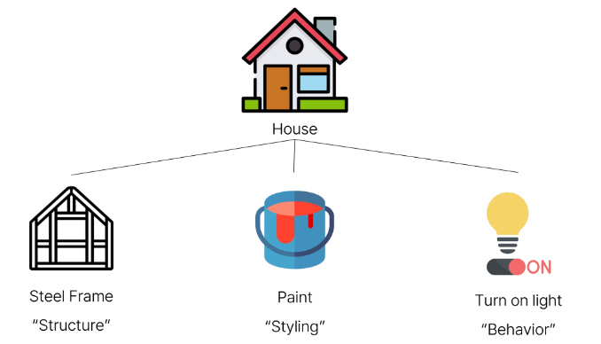
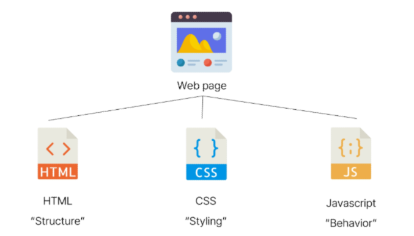

## HTML과 CSS의 구조

### 목차
- [웹 소개]
- [웹 구조화]
  - [HTML]
  - [HTML의 구조]
  - [텍스트 구조]
- [웹 스타일링]
  - [CSS]
  - [CSS 선택자]
  - [우선순위]

### 웹소개
- World Wide Web
  - 인터넷으로 연결된 컴퓨터들이 정보를 공유하는 거대한 정보 공간
- Web
  - Web site, Web application 등을 통해 사용자들이 정보를 검색하고 상호 작용하는 기술
- Web site
  - 인터넷에서 여러 개의 <span style = 'color:salmon'>Web page</span>가 모인 것으로, 사용자들에게 정보나 서비스를 제공하는 공간
- Web page 
  - HTML, CSS 등의 웹 기술을 이용하여 만들어진, <span style = 'color:salmon'>'Web site'를 구성하는 하나의 요소</span>
  - 
#### Web page 구성 요소



### 웹 구조화
### HTML
- HyperText Markup Language 
- 웹 페이지의 의미와 <span style = 'color:salmon'>구조</span>를 정의하는 언어


# 인라인 스타일은 제일 비추천

```
html css javascript
html 뼈대
CSS 디자인
javascript 로직
```