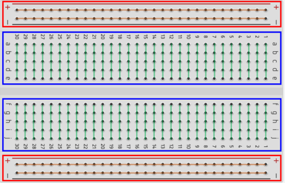
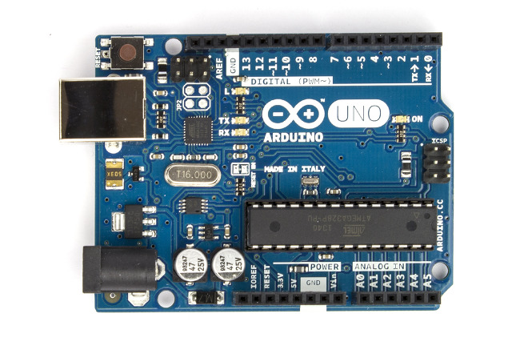
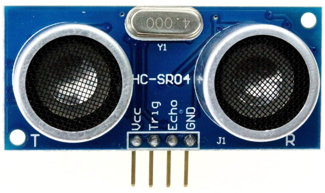
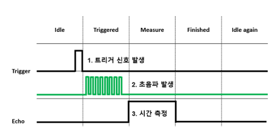

## 브레드 보드
- 버스 띠: 전원선(+)과 접지선(-)으로 구성, 내부에서 가로로 연결
- 단자 띠: 부품을 꽂는 부분, 같은 라인에 꽂으면 합선이 일어나므로 주의
- 
## 아두이노 우노 R3
- 
- Atmega328P 마이크로 컨트롤러 보드
- 디지털 입출력 핀 14개, 아날로그 입력핀 6개
- 16Mhz 수정 진동자 사용
- USB B타입 연결 포트
- ICSP헤더와 리셋버튼
- USB to Serial converter로 ATmega16U2 사용
- USB연결로 전원공급 및 PC와 통신 가능
- LED 표시등

### 특징 설명
- 마이크로컨트롤러
  - Atmega329P 마이크로 컨트롤러가 장착, 프로그램을 실행하고 다양한 입력 및 출력 관리
- 입출력 핀
  - 디지털 핀 14개, 이중 6개는 PWM(Pulse Width Modulation)출력 지원
  - 아날로그 핀 6개
- USB인터페이스
  - 컴퓨터와의 연결을 위한 USB인터페이스 존재
  - 프로그래밍 및 전력 공급 가능
- 전원 공급
  - USB를 통한 전력공급
  - 외부전원(7~12V)
- 프로그래밍
  - Arduino IDE를 사용하여 프로그래밍
  - C/C++과 유사한 아두이노 프로그래밍 언어 사용
- 확장성
  - Shield라 불리는 확장보드 추가하여 기능 확장 가능

## 초음파센서(HC-SR04)
- 
- 초음파를 이용해 물체와의 거리 측정
- 초음파를 방사시키고 장애물과 만난 후 반사되어 돌아오는 시간차와 음파의 속력을 이용해 거리를 계산

### 핀
- Vcc: 5V전원
- GND: Ground
- Trig: 초음파 발신
- Echo: 초음파 수신

### 원리



### 예제 코드
```c
// 아두이노에 초음파센서 Trig와 Echo 핀 설정
const int trig = 9;
const int echo = 8;

void setup() {
  Serial.begin(9600); // 시리얼 통신 시작
  pinMode(trig, OUTPUT); // trig 핀을 출력으로 설정
  pinMode(echo, INPUT); // echo 핀을 입력으로 설정
}

void loop() {
  long duration, distance;
  
  digitalWrite(trig, LOW); 
  // 초음파 발신 전 trig 핀을 low로 설정
  // trig가 high가 되었을 경우 초음파 발신
  delayMicroseconds(2);

  digitalWrite(trig, HIGH); // 초음파 발신
  delayMicroseconds(10);
  digitalWrite(trig, LOW);  // echo핀의 신호를 기다린 이후 다시 초기값인 low로 설정

  duration = pulseIn(echo, HIGH); // echo 핀으로부터 초음파 수신 시간 측정
  distance = (duration * 0.0343) / 2; 
  // 시간을 거리로 변환하는식
  // 초음파의 속도는 공기중에서 초당 약 343ms의 속도를 가지고 있다.
  // echo핀에서 초음파 수신시간에 초음파 속도를 곱하고 왕복 시간이므로 2로 나누어 준다.

  Serial.print("Distance: ");
  Serial.print(distance);
  Serial.println(" cm");

  delay(1000); // 측정 주기 설정 (1초에 한 번)
}
```

#### reference
[아두이노 실습(thinkercad)](https://www.tinkercad.com/)