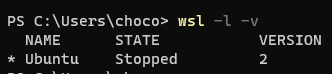
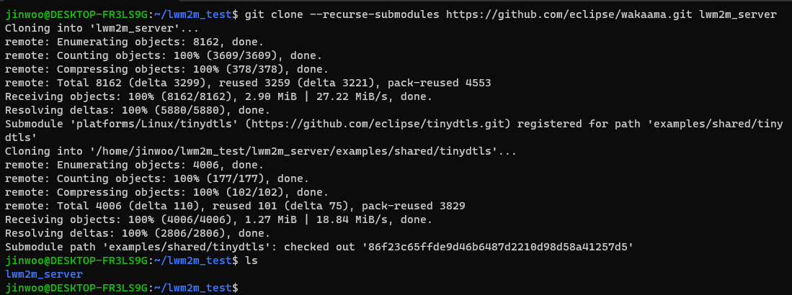
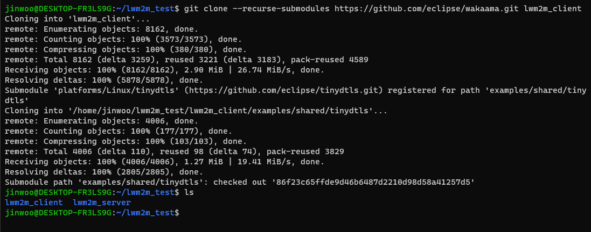
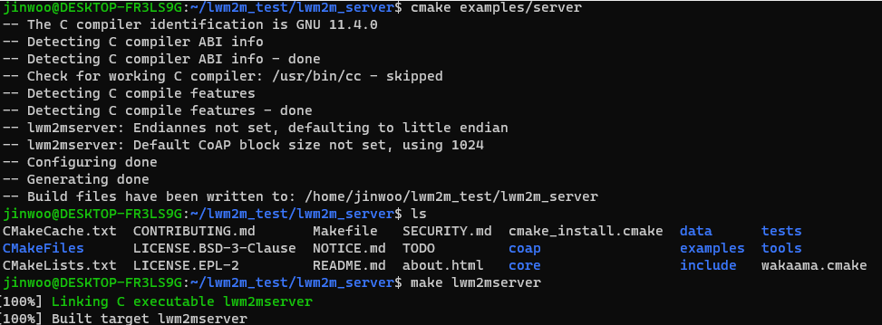
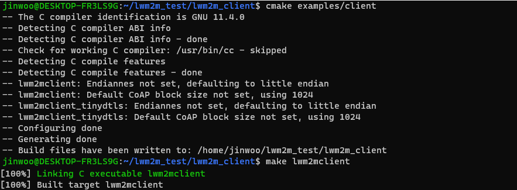

## WSL
- Windows Subsystem for Linux
- 윈도우의 가상화 기능을 활용해서 윈도우 위에서 리눅스를 사용가능하게 만들어주는 툴
## Ubuntu
- wsl에서 사용할 리눅스 배포판
### 설치과정
- 윈도우에서 Powershell을 관리자 권한으로 실행
  - 윈도우 버전확인!
- powershell 명령어
  - $ wsl --install: wsl2설치
  - $ wsl --set-default-version 2: wsl 버전기본값 2로 변경
- ubuntu 설치
  - 마이크로소프트 스토어에서 ubuntu 검색
  - 원하는 리눅스 배포판 설치
- ubuntu 실행
  - 다음과 같은 오류 발생시!
    - wslregisterdistribution failed with error: 0x80370102
    - [참고](https://www.codeit.kr/community/questions/UXVlc3Rpb246NjJlYTg5ZmNjN2FiMjgzYjFkYmZlMGFj)
  - 처음 실행시 사용자 이름과 비밀번호 설정
- powershell에서 `$ wsl -l -v` 명령어 실행
  - ubuntu 버전2가 나오면 성공!
  - 
- ubuntu실행
  - Cmake 빌드 도구와 라이브러리 설치
  - 명령어: sudo apt-get install build-essential libssl-dev cmake

### LwM2M 오픈소스 실습
- [오픈소스](https://github.com/eclipse/wakaama)
- 오픈소스 내에서는 Client, Server 소스가 모두 포함되어 있어 두번 클론하거나 각각 따로 분리하는 과정이 필요
  - 
  - 
- server, client의 ubuntu창 두개를 만들어 각각 빌드 후 실행 파일 만들기(공식깃허브 README.md참고)
  - 
  - 
- server, client 순서대로 실행하여 연동 확인
  - 

#### reference
[lwM2M 깃허브](https://github.com/eclipse/wakaama)
[WSL설치 및 사용법](https://www.lainyzine.com/ko/article/how-to-install-wsl2-and-use-linux-on-windows-10/)