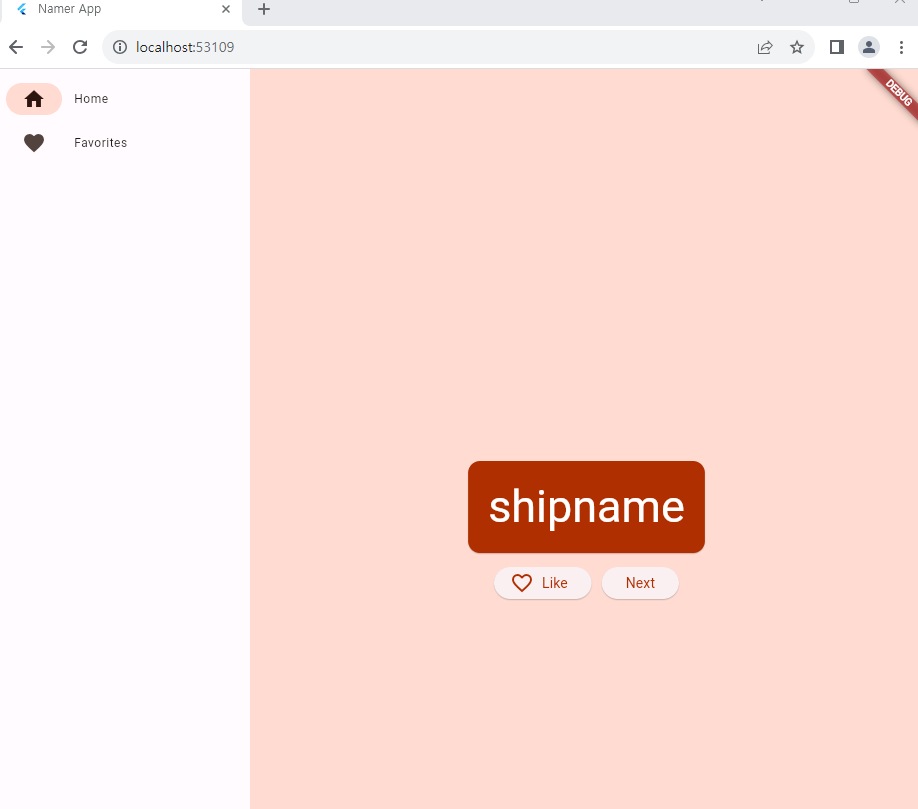
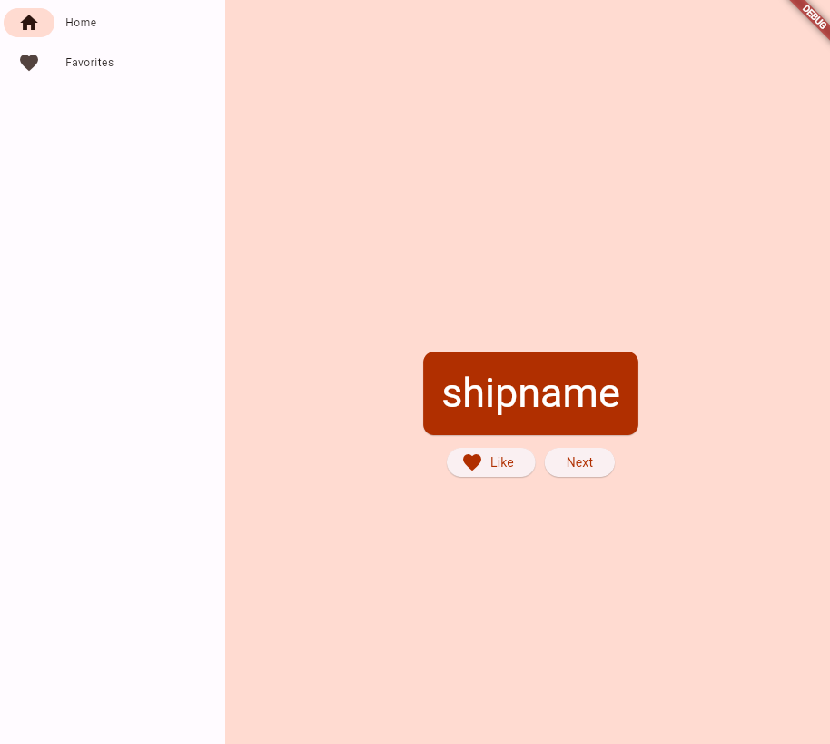
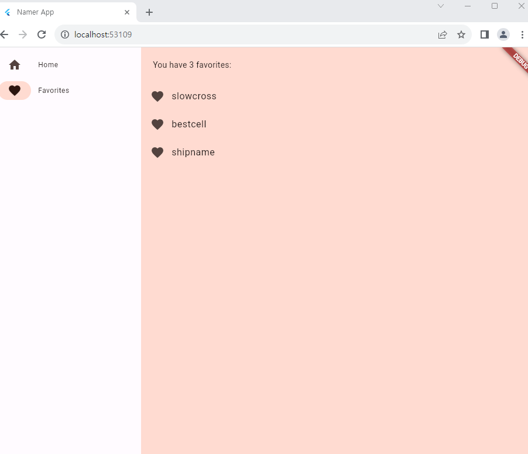

## 1. Flutter 의 Hot Reloaded 기술이란 무엇인가?

- Flutter의 핫리로드(Hot Reload)기술은 앱 개발 과정에서 개발자가 코드를 수정한 후에도 앱을 다시 시작하지 않고도 변경사항을 실시간으로 앱에 반영해주는 기능
- 개발자는 앱 개발 과정에서 보다 빠르게 실험, 디자인 수정, 코드 개선 가능
- 핫 리로드를 통해 앱의 사용자 경험을 개선, 버그를 신속하게 수정하는데 유용
  - 개발 생산성을 높여주는 강력한 기능 중 하나로, 더 빠르고 효율적인 앱개발 가능

- Flutter는 JIT(Just-in -Time) 컴파일러를 사용하여 개발중에 핫 리로드와 디버깅 제공
- 핫리로드는 변경된 코드를 빠르게 적용하여 확인할 수 있지만, 코드가 커지거나 복잡해지면 디버깅 속도가 느려짐

## 2. Flutter 는 기본적으로 Debug 모드로 실행된다. Debug 모드는 Debugging 정보를 포함해 매우 느리게 앱이 실행된다. 공식문서를 참고해 개발 완료 후 이를 해결하기 위해 어떻게 처리를 해주어야 하는지 간략히 요약하시오.

- Flutter 앱의 성능을 향상시키기 위한 단계
  - Release 모드
    - Release 모드로 앱을 빌드하여 디버깅 정보를 제거하고 최적화된 앱을 생성
    - Release 모드는 앱을 빌드할 때 디버깅 정보를 제거하고 코드를 최적화하여 실행 속도 향상
  - Flutter 앱 최적화
    -  불필요한 코드, 로그, 혹은 디버깅 용도로 추가된 요소들 제거
    -  필요한 경우, 성능을 저하시킬 수 있는 부분을 식별하고 최적화
  - 네트워크 및 데이터 최적화
    - 네트워크 요청을 최소화
    - 데이터를 효율적으로 관리하여 앱의 성능 향상
    - 캐싱, 압축, 프리페칭 등을 이용하여 네트워크와 데이터 사용을 최적화
  - 테스트 및 성능 분석
    - 릴리즈 버전을 테스트
    - 성능 프로파일링 도구를 사용하여 앱의 성능 평가
    - 이를 통해 어떤 부분에서 성능이 저하되는지 식별하고 개선할 수 있는 방법 모색

## 3. Flutter 에서 외부 패키지는 어떤 방식으로 사용하는지 간략히 정리해 보자.

- Flutter는 pub.dev라는 공식 패키지 저장소를 가지고 있어 다양한 기능과 라이브러리를 제공
- 따라서 필요한 기능이나 라이브러리가 있다면 pub.dev에서 검색하여 해당 패키지를 찾고, 위의 단계를 따라 의존성을 선언하고 사용가능

- 1. 의존성 선언:
  - pubspec.yaml 파일에 외부 패키지의 의존성을 선언
  - 패키지의 이름과 버전을 명시하여 dependencies 섹션에 추가

- 2. 의존성 가져오기:
  - 터미널에서 flutter pub get 명령어를 실행하여 선언한 의존성을 가져오기
  - 이 명령은 pubspec.yaml 파일에 선언된 패키지들을 다운로드하고 프로젝트에 적용

- 3. 패키지 사용하기:
  - 해당 패키지의 클래스, 함수 또는 기능을 사용하려면 import 문을 통해 해당 패키지를 가져와야 함

## 4. Write your first app 파트를 끝까지 구현해 보고 동작시킨 후 스크린샷을 포함해 진행과정중 느낀점을 md 파일에 정리해 보자.

- 기본적인 짜임은 다른 플랫폼과 비슷했고, vs코드와 안드로이드 스튜디오 두 개를 사용하였지만 쓰임새가 다른 부분에 대해서 적용하기가 힘이 들었다.
